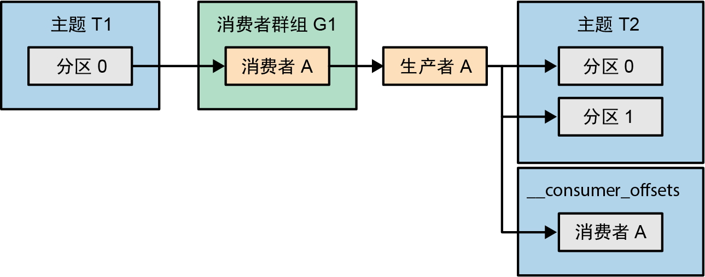
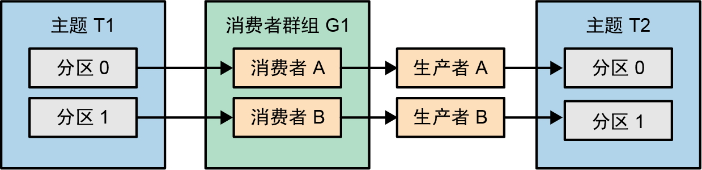
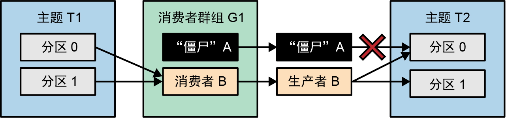

# 七、精确一次性语义

Kafka的精确一次性语义由两个关键特性组成：**幂等生产者**（避免因重试导致的消息重复）和**事务**语义（保证流式处理应用程序中的精确一次性处理）。

> **注意：**
>
> 要想本章讨论的精确一次性语义有意义，那么必须先满足至少一次性语义。当满足了至少一次性语义之后，通过避免消息重复，进而获得精确一次性的保证。
>
> 所以，kafka集群首先需要保证：
>
> * 禁用不完全的首领选举
> * 最少同步副本数大于等于二
>
> 然后，需要保证生产者正确设置了：
>
> * acks = all
> * 只要是可重试错误，直到导致问题的原因得到修复，必须一直重复

### 7.1 幂等生产者

一个最典型的场景是分区首领收到生产者发送的一条消息，这条消息被跟随者成功复制，然后，首领所在的broker在向生产者发送响应之前崩溃了。生产者没有收到回应，在一段时间之后将重新发送消息。消息被发送给了新首领，而新首领已经有了上一次写入的消息副本，结果导致消息重复。

Kafka的幂等生产者可以自动检测并解决消息重复问题。

#### 7.1.1 工作原理

如果启用了幂等生产者，那么每条**消息**都将包含**生产者ID(PID)**和**序列号**。我们将它们与**目标主题**和**分区**组合在一起，用于唯一标识一条消息。broker会用这些唯一标识符跟踪写入每个分区的**最后5条消息**。为了减少每个分区需要跟踪的序列号数量，生产者需要将**max.inflight.requests**设置成5或更小的值（默认值是5）。

**如果broker收到之前已经收到过的消息，那么它将拒绝这条消息，并返回错误。**生产者会记录这个错误，并反映在指标当中，但不抛出异常，也不触发告警。在生产者客户端，错误将被添加到record-error-rate指标当中。在broker端，错误是ErrorsPerSec指标的一部分。

如果broker收到一个非常大的序列号该怎么办？如果broker期望消息2后面跟着消息3，但收到了消息27，那么这个时候该怎么办？在这种情况下，broker将返回**“乱序”**错误。如果使用了不带事务的幂等生产者，则这个错误可能会被忽略。

**1. 生产者重启**

当一个生产者发生故障时，我们通常会创建新生产者来代替它，如果启用了幂等生产者，那么**生产者在重启时就会连接broker并生成生产者ID**。生产者在每次初始化时都会产生一个新ID（假设没有启用事务）。**这意味着如果一个生产者发生故障，取代它的生产者发送了一条旧生产者已经发送过的消息，那么broker将无法检测到重复，因为这两条消息有不同的生产者ID和序列号，将被视为两条不同的消息。**需要注意的是，如果一个旧生产者被挂起，但在替代它的新生产者启动之后又“活”过来了，那么情况也一样——旧生产者不会被认为是“僵尸”，它们是两个拥有不同ID的生产者。

**2. broker故障**

当一个broker发生故障时，控制器将为首领副本位于这个broker上的分区选举新首领。每次生成新消息时，首领都会用最后5个序列号更新内存中的生产者状态。每次从首领复制新消息时，跟随者副本都会更新自己的内存。当跟随者成为新首领时，它的内存中已经有了最新的序列号，并且可以继续验证新生成的消息，不会有任何问题或延迟。

如果旧首领又“活”过来了，会发生什么呢？在重启之后，内存中没有旧首领的生产者状态。为了能够恢复状态，每次在关闭或创建日志片段时broker都会将生产者状态快照保存到文件中。broker在启动时会从快照文件中读取最新状态，然后通过复制当前首领来更新生产者状态。当它准备好再次成为首领时，内存中已经有了最新的序列号。

如果broker发生崩溃，但没有更新最后一个快照，会发生什么呢？生产者ID和序列号也是Kafka消息格式的一部分。在进行故障恢复时，我们将通过读取旧快照和分区最新日志片段里的消息来恢复生产者状态。等故障恢复完成，一个新的快照就保存好了。

如果分区里没有消息，会发生什么呢？没有消息也就意味着没有重复消息。我们可以立即开始接收新消息（同时将状态缺失的警告信息记录下来），并创建生产者状态。

#### 7.1.2 局限性

**幂等生产者只能防止由生产者内部重试逻辑引起的消息重复，不管这种重试是由生产者、网络还是broker错误所导致。**对于使用同一条消息调用两次producer.send()就会导致消息重复的情况，即使使用幂等生产者也无法避免。这是因为生产者无法知道这两条消息实际上是一样的。

应用程序有多个实例或一个实例有多个生产者的情况非常常见。如果两个生产者尝试发送同样的消息，则幂等生产者将无法检测到消息重复。

#### 7.1.3 如何使用幂等生产者

幂等生产者使用起来非常简单，只需在生产者配置中加入**enable.idempotence=true**。如果生产者已经配置了**acks=all**，那么在性能上就不会有任何差异。

在启用了幂等生产者之后，会发生下面这些变化。

* 为了获取生产者ID，生产者在启动时会调用一个额外的API。
* 每个消息批次里的第一条消息都将包含**生产者ID**和**序列号**（批次里其他消息的序列号基于第一条消息的序列号递增）。这些新字段给每个消息批次增加了96位（生产者ID是长整型，序列号是整型），这对大多数工作负载来说几乎算不上是额外的开销。
* broker将会验证来自每一个生产者实例的序列号，并保证没有重复消息。
* 每个分区的消息顺序都将得到保证，即使**max.in.flight.requests.per.connection**被设置为大于1的值（5是默认值，这也是幂等生产者可以支持的最大值）。

### 7.2 事务

为了让流式处理应用程序生成正确的结果，要**保证每个输入的消息都被精确处理一次，即使是在发生故障的情况下**。Kafka的事务机制可以保证流式处理应用程序生成准确的结果，这样开发人员就可以在对准确性要求较高的场景中使用流式处理了。

**Kafka的事务机制是专门为流式处理应用程序而添加的。因此，它非常适用于流式处理应用程序的基础模式，即“消费–处理–生产”。**事务可以保证流式处理的精确一次性语义——在更新完应用程序内部状态并将结果成功写入输出主题之后，对每个输入消息的处理就算完成了。

#### 7.2.1 事务的应用场景

**一些流式处理应用程序对准确性要求较高，特别是如果处理过程包含了聚合或连接操作，那么事务对它们来说就会非常有用。**如果流式处理应用程序只进行简单的转换和过滤，那么就不需要更新内部状态，即使出现了重复消息，也可以很容易地将它们过滤掉。但是，如果流式处理应用程序对几条消息进行了聚合，一些输入消息被统计了不止一次，那么就很难知道结果是不是错误的。如果不重新处理输入消息，则不可能修正结果。

#### 7.2.2 事务可以解决哪些问题

假设有一个简单的流式处理应用程序：它**从源主题读取消息，然后可能会对消息做一些处理，再将结果写入另一个主题**。我们想要**确保处理的每一条消息的结果只被写入一次**。那么，哪些地方有可能出错呢？

1.  应用程序崩溃导致的重复处理

    在从源集群读取并处理了消息之后，应用程序必须做两件事：一是**将结果写入输出主题**，二是**提交已处理的消息的偏移量**。假设这两个动作就按照这个顺序发生。**如果应用程序在发送结果之后发生崩溃，但偏移量还没有提交**，该怎么办？

    几秒之后，因为没有心跳，所以将触发**再均衡**，消费者读取的分区将被重新分配给其他消费者。新消费者将从最后提交的偏移量的位置开始读取这些分区的消息。在最后一个提交的偏移量和应用程序发生崩溃那个位置之间的消息将被再次处理，结果也将被再次写入输出主题——这就出现了重复。
2.  “僵尸”应用程序导致的重复处理

    如果应用程序从Kafka读取了一个消息批次，但还没有开始处理它们就被挂起或与Kafka断开了连接，那么这个时候会发生什么？

    就像前面的场景一样，在停止发送心跳一段时间之后，应用程序将被认为已经“死亡”，它的分区将被重新分配给消费者群组里的其他消费者。新消费者将重新读取这个消息批次，对其进行处理，并将结果写入输出主题，然后继续。

    这个时候，**之前的应用程序实例（被挂起的那个）可能又恢复过来了**：继续处理它最近读取的消息批次，并将结果写入输出主题。所有这些都可以在它“向Kafka轮询更多消息或发送心跳，然后发现它被认为已经“死亡”，并且现在有另外一个实例拥有这些分区”之前完成。

    **一个“死亡”但不知道自己已经“死亡”的消费者被称为“僵尸”。**在这个场景中，如果没有额外的保证，则“僵尸”消费者可以向输出主题生成结果，进而导致重复。

#### 7.2.3 事务是如何保证精确一次性的

**精确一次处理意味着消费、处理和生产都是原子操作，要么提交偏移量和生成结果这两个操作都成功，要么都不成功。**我们要确保不会出现只有部分操作执行成功的情况（提交了偏移量但没有生成结果，反之亦然）。

为了支持这种行为，Kafka事务引入了**原子多分区写入**的概念。我们知道，**提交偏移量和生成结果都涉及向分区写入数据，结果会被写入输出主题，偏移量会被写入consumer\_offsets主题**。如果可以**打开一个事务，向这两个主题写入消息，如果两个写入操作都成功就提交事务，如果不成功就中止，并进行重试，那么就会实现我们所追求的精确一次性语义**。

<figure><figcaption></figcaption></figure>

为了启用事务和执行原子多分区写入，我们使用了**事务性生产者**。事务性生产者实际上就是一个配置了**transactional.id**并用**initTransactions()**方法初始化的Kafka生产者。**与producer.id（由broker自动生成）不同，transactional.id是一个生产者配置参数，在生产者重启之后仍然存在**。实际上，transactional.id主要用于在重启之后识别同一个生产者。broker维护了transactional.id和producer.id之间的映射关系，如果对一个已有的transactional.id再次调用initTransactions()方法，则生产者将分配到与之前一样的producer.id，而不是一个新的随机数。

防止“僵尸”应用程序实例重复生成结果需要一种**“僵尸”隔离机制**，或者防止“僵尸”实例将结果写入输出流。通常可以使用**epoch**来隔离“僵尸”。**在调用initTransaction()方法初始化事务性生产者时，Kafka会增加与transactional.id相关的epoch。带有相同transactional.id但epoch较小的发送请求、提交请求和中止请求将被拒绝**，并返回FencedProducer错误。旧生产者将无法写入输出流，并被强制close()，以防止“僵尸”引入重复记录。Kafka 2.5及以上版本支持将消费者群组元数据添加到事务元数据中。这些元数据也被用于隔离“僵尸”，在对“僵尸”实例进行隔离的同时允许带有不同事务ID的生产者写入相同的分区。

在很大程度上，**事务是一个生产者特性**。创建事务性生产者、开始事务、将记录写入多个分区、生成偏移量并提交或中止事务，这些都是由生产者完成的。然而，这些还不够。**以事务方式写入的记录，即使是最终被中止的部分，也会像其他记录一样被写入分区。消费者也需要配置正确的隔离级别，否则将无法获得我们想要的精确一次性保证。**

我们通过设置**isolation.level**参数来控制消费者如何读取以事务方式写入的消息：

* **如果设置为read\_committed，那么调用consumer.poll()将返回属于已成功提交的事务或以非事务方式写入的消息，它不会返回属于已中止或执行中的事务的消息**。
* 默认的隔离级别是**read\_uncommitted**，它**将返回所有记录，包括属于执行中或已中止的事务的记录。**

配置成read\_committed并不能保证应用程序可以读取到特定事务的所有消息。也可以只订阅属于某个事务的部分主题，这样就可以只读取部分消息。此外，应用程序无法知道事务何时开始或结束，或者哪些消息是哪个事务的一部分。

为了保证按顺序读取消息，read\_committed隔离级别将不返回在事务开始之后（这个位置也被叫作最后稳定偏移量，last stable offset，LSO）生成的消息。这些消息将被保留，直到事务被生产者提交或终止，或者事务超时（通过transaction.timeout.ms参数指定，默认为15分钟）并被broker终止。**长时间使事务处于打开状态会导致消费者延迟，从而导致更高的端到端延迟。**

#### 7.2.4 事务不能解决哪些问题

在Kafka中加入事务是为了提供多**分区原子写入**（不是读取），并**隔离流式处理应用程序中的“僵尸”生产者**。在“消费–处理–生产”流式处理任务中，事务为我们提供了精确一次性保证。在其他场景中，事务要么不起作用，要么需要做额外的工作才能获得我们想要的结果。

下面是Kafka事务无法实现精确一次性保证的几种场景：

1.  **在流式处理中执行外部操作**

    假设流式处理应用程序在处理数据时需要向用户发送电子邮件。在应用程序中启用精确一次性语义并不能保证邮件只发送一次，这个保证只适用于将记录写入Kafka。使用序列号去重，或者使用标记中止或取消事务在Kafka中是有效的，但它不会撤销已发送的电子邮件。在流式处理应用程序中执行的任何带有外部效果的操作都是如此：调用REST API、写入文件，等等。
2.  **从Kafka中读取数据并写入数据库**

    在这种情况下，应用程序会将数据写入外部数据库，而不是Kafka。这里没有生产者参与，我们用数据库驱动器（如JDBC）将记录写入数据库，消费者会将偏移量提交给Kafka。没有任何一种机制允许将外部数据库写入操作与向Kafka提交偏移量的操作放在同一个事务中。不过，我们**可以在数据库中维护偏移量，并在一个事务中将数据和偏移量一起提交到数据库——这将依赖于数据库的事务保证机制而不是Kafka的事务保证机制**。

    > 微服务通常需要在一个原子事务中更新数据库并向Kafka发布消息，要么两个操作都生效，要么都不生效。
    >
    > 这个问题的一种常见解决方案是使用**发件箱模式**。微服务只会将消息发布到一个Kafka主题（也就是“发件箱”），然后另外一个独立的消息中继服务会从Kafka读取消息并更新数据库。**因为Kafka不会保证数据库操作的精确一次性更新，所以需要确保数据库更新是幂等的。**
    >
    > 这个模式可以保证消息最终到达Kafka、主题消费者和数据库，或者都不到达。
    >
    > 这个模式的反向模式是将数据库作为发件箱，另外一个中继服务将确保将数据库更新也作为消息发送给Kafka。如果可以使用关系数据库内置的约束（比如唯一索引和外键），那么这种模式就是首选。
3.  **从一个数据库读取数据写入Kafka，再从Kafka将数据写入另一个数据库**

    Kafka并不支持这种端到端的事务保证。除了很难保证在同一个事务中提交记录和偏移量，还有另外一个难点：**Kafka的read\_committed隔离级别太弱了，根本无法保留数据库的事务**。**消费者不仅看不到未提交的消息，也不保证可以看到事务中已提交的所有消息，因为消息在某些主题上可能会滞后，而消费者没有事务的边界信息，所以它不知道事务何时开始和结束，也不知道看到的是部分消息还是全部消息。**
4.  **将数据从一个集群复制到另一个集群**

    将数据从一个Kafka集群复制到另一个集群是有可能支持精确一次性保证的。

    但这并不能保证事务是原子的。如果一个应用程序以事务的方式生成了几条记录和偏移量，然后MirrorMaker 2.0将它们复制到了另一个Kafka集群，那么在复制过程中事务属性就有可能会丢失。造成事务属性丢失的原因与将数据从Kafka复制到关系数据库一样：从Kafka读取数据的消费者并不知道或者能够保证已经读取了事务的所有记录。如果它只订阅了部分主题，那么就会只复制事务的一部分记录。
5.  **发布和订阅模式**

    事务为发布和订阅模式提供了一些保证：配置了read\_committed隔离级别的消费者将看不到已中止事务的消息，但这种保证并不是精确一次性的。消费者可以多次处理一条消息，具体取决于它们的偏移量提交逻辑。

    **对于发布和订阅模式，Kafka提供的保证与JMS事务类似，消费者需要配置成read\_committed隔离级别，以保证未提交的事务对消费者是不可见的**。JMS broker对所有消费者隐藏了未提交的事务。

    > 我们要避免的一种模式是在发布消息之后等待另一个应用程序响应，然后才提交事务，而那个应用程序直到事务被提交之后才能收到消息，从而导致死锁。

#### 7.2.5 如何使用事务

使用事务的最常见也最推荐的方式是在Streams中启用精确一次性保证。无须直接管理事务，Streams会自动提供我们需要的保证。事务最初就是为这个场景而设计的，所以在Streams中启用事务是最简单也最有可能符合我们预期的方式。

如果想在不使用Streams的情况下获得精确一次性保证，可以直接使用事务API。

```
  
  Properties producerProps = new Properties();
  producerProps.put(ProducerConfig.BOOTSTRAP_SERVERS_CONFIG, "localhost:9092");
  producerProps.put(ProducerConfig.CLIENT_ID_CONFIG, "DemoProducer");
  // 为生产者配置transactional.id，让它成为一个能够进行原子多分区写入的事务性生产者。
  // 事务ID必须是唯一且长期存在的，因为本质上就是用它定义了应用程序的一个实例。
  producerProps.put(ProducerConfig.TRANSACTIONAL_ID_CONFIG, transactionalId); 
  ​
  producer = new KafkaProducer<>(producerProps);
  ​
  ​
  Properties consumerProps = new Properties();
  consumerProps.put(ConsumerConfig.BOOTSTRAP_SERVERS_CONFIG, "localhost:9092");
  consumerProps.put(ConsumerConfig.GROUP_ID_CONFIG, groupId);
  // 消费者不提交自己的偏移量——生产者会将偏移量提交作为事务的一部分，所以需要禁用自动提交。
  consumerProps.put(ConsumerConfig.ENABLE_AUTO_COMMIT_CONFIG, "false"); 
  // 为了干净地读取事务（忽略执行中和已中止的事务），可以将消费者隔离级别设置为read_committed。
  consumerProps.put(ConsumerConfig.ISOLATION_LEVEL_CONFIG, "read_committed"); 
  ​
  consumer = new KafkaConsumer<>(consumerProps);
  ​
  ​
  // 事务性生产者要做的第一件事是初始化，包括注册事务ID和增加epoch的值（确保其他具有相同ID的生产者将被视为“僵尸”，并中止具有相同事务ID的旧事务）。
  producer.initTransactions(); 
  ​
  consumer.subscribe(Collections.singleton(inputTopic)); 
  ​
  while (true) {
    try {
      ConsumerRecords<Integer, String> records = consumer.poll(Duration.ofMillis(200));
      if (records.count() > 0) {
        // 开始事务
        producer.beginTransaction(); 
        for (ConsumerRecord<Integer, String> record : records) {
          ProducerRecord<Integer, String> customizedRecord = transform(record);
          producer.send(customizedRecord);
        }
        Map<TopicPartition, OffsetAndMetadata> offsets = consumerOffsets();
        // 需要将偏移量提交作为事务的一部分，
        // 这样可以保证如果生成结果失败，则未成功处理的消息的偏移量将不会被提交
        producer.sendOffsetsToTransaction(offsets, consumer.groupMetadata());
        // 提交事务
        producer.commitTransaction(); 
      }
    } catch (ProducerFencedException|InvalidProducerEpochException e) { 
      // 如果遇到这个异常，则说明应用程序实例变成“僵尸”了
      throw new KafkaException(String.format(
      "The transactional.id %s is used by another process", transactionalId));
    } catch (KafkaException e) {
      // 如果在提交事务时遇到错误，则可以中止事务，重置消费者偏移量位置，并进行重试。
      producer.abortTransaction(); 
      resetToLastCommittedPositions(consumer);
    }
  }
```

> 注意：
>
> 上述代码片段描述了一个“自产自销”的无限循环过程，去掉消费者的逻辑后，剩下的部分才是事务的逻辑——多分区原子写入。

#### 7.2.6 事务ID和隔离

**一个应用程序实例的事务ID在重启前后必须保持一致，而且应用程序的不同实例的事务ID不能一样，否则broker将无法隔离“僵尸”实例。**

Kafka 2.5中引入了除事务ID之外的第二种基于消费者群组元数据的隔离方法(KIP-447)。我们会调用生产者的偏移量提交方法，并将消费者群组元数据（而不只是消费者群组ID）作为参数传给它。

假设主题T1有两个分区，分别是0和1。两个分区分别被同一消费者群组中的两个消费者消费，每个消费者都将消息传给对应的事务性生产者——一个事务ID为A，另一个事务ID为B，它们分别向主题T2的分区0和分区1写入结果。

<figure><figcaption></figcaption></figure>

如果消费者A和生产者A所在的应用程序实例变成“僵尸”，则消费者B将开始读取两个分区。

<figure><figcaption></figcaption></figure>

如果想保证不会有“僵尸”写入分区0，那么消费者B就不能读取分区0以及用事务ID B写入分区0。应用程序需要实例化一个事务ID为A的新生产者，该生产者可以安全地写入分区0，并隔离事务ID为A的旧生产者。

但这样做有点儿浪费，我们可以**在事务中包含消费者群组信息**，生产者B的事务将显示它们来自新一代消费者群组，所以它们可以通过，而“僵尸”生产者A的事务将显示它们来自老一代消费者群组，所以它们将被隔离。

#### 7.2.7 事务的工作原理

Kafka事务的基本算法受到了**Chandy-Lamport快照**的启发，它会将一种被称为**“标记”(marker)**的消息发送到通信通道中，并根据标记的到达情况来确定一致性状态。

Kafka事务根据**标记消息**来判断跨多个分区的事务是否被提交或被中止——当生产者要提交一个事务时，它会发送**“提交”消息**给**事务协调器**，事务协调器会将**提交标记**写入所有涉及这个事务的**分区**。如果生产者在向部分分区写入提交消息后发生崩溃，该怎么办？Kafka事务使用**两阶段提交**和**事务日志**来解决这个问题。

总的来说，这个算法会执行如下步骤：

1. 记录正在执行中的事务，包括所涉及的分区。
2. 记录提交或中止事务的意图——一旦被记录下来，到最后要么被提交，要么被中止。
3. 将所有事务标记写入所有分区。
4. 记录事务的完成情况。

要实现这个算法，Kafka需要一个事务日志。这里使用了一个叫作**\_\_transaction\_state**的内部主题。

在开始一个事务之前，生产者需要通过调用**initTransaction()**来注册自己。这个请求会被发送给一个broker，它将成为这个事务性生产者的**事务协调器**。就像每一个broker都是部分消费者群组的消费者群组协调器一样，每一个broker都是部分生产者的事务协调器。每一个事务ID对应的事务协调器就是映射到这个事务ID的事务日志分区的首领。**initTransaction() API注册了一个带有新事务ID的协调器或者增加现有事务ID的epoch，用以隔离变成“僵尸”的旧生产者**。当epoch增加时，挂起的事务将被中止。

下一步是调用**beginTransaction()**。这个方法不是协议的一部分，它只是**告诉生产者，现在有一个正在执行中的事务**。broker端的事务协调器仍然不知道事务已经开始。不过，一旦生产者开始发送消息，**每次生产者检测到消息被发送给一个新分区时，都会向broker发送AddPartitionsToTxnRequest请求，告诉broker自己有一个执行中的事务，并且这些分区是事务的一部分**。这些信息将被记录在事务日志中。

当生成结果并准备提交事务时，首先需要提交在这个事务中处理好的消息的偏移量。**偏移量可以在任何时候提交，但一定要在事务提交之前**。**sendOffsetsToTransaction()方法将向事务协调器发送一个请求，其中包含了偏移量和消费者群组ID**。事务协调器将用消费者群组ID查找群组协调器，并提交偏移量。

**commitTransaction()方法或abortTransaction()方法**将向事务协调器发送一个EndTransactionRequest。事务协调器会把提交或中止事务的意图记录到事务日志中。**如果这个步骤执行成功，那么事务协调器将负责完成提交（或中止）过程。它会向所有涉及事务的分区写入一个提交标记，然后将提交成功的信息写入事务日志。**需要注意的是，**如果事务协调器在记录提交意图之后以及在完成提交流程之前被关闭或发生崩溃，那么将会选举出一个新的事务协调器，它会从事务日志中获取提交意图，并完成提交流程。**

如果一个事务未能在**transaction.timeout.ms**指定的时间内提交或中止，则事务协调器将自动中止它。

> **每个收到由事务性或幂等生产者发送的消息的broker都会在内存中保存生产者ID或事务性ID，以及生产者发送的最后5个消息批次的相关状态：序列号、偏移量等。**这些状态在生产者停止活动之后会继续保留transactional.id.expiration.ms指定的时间（默认为7天）。这样生产者就可以在不抛出UNKNOWN\_PRODUCER\_ID异常的情况下恢复活动。
>
> **如果以非常高的速率创建新的幂等生产者或事务ID，但从不重用它们，则可能会导致broker发生内存泄漏。**如果在一周内连续每秒新增3个幂等生产者，那么将产生180万个状态条目，总共需要保存900万个消息批次元数据，占用大约5 GB内存。这可能会导致broker内存不足或出现严重的垃圾回收停顿。
>
> **建议在应用程序启动时初始化几个长期使用的生产者，并在应用程序生命周期中重用它们。如果不能这么做（FaaS会让这变得很困难），那么建议减小transactional.id.expiration.ms的值，这样事务ID就会更快过期，不会让旧状态占用broker太大的内存。**

#### 7.2.8 事务的性能

事务给**生产者**带来了一些额外的开销：

* 事务ID注册在生产者生命周期中只会发生一次。
* 分区事务注册最多会在每个分区加入每个事务时发生一次，然后每个事务会发送一个提交请求，并向每个分区写入一个额外的提交标记。
* 事务初始化和事务提交请求都是同步的，在它们成功、失败或超时之前不会发送其他数据，这进一步增加了开销。

需要注意的是，**生产者在事务方面的开销与事务包含的消息数量无关**。因此，**一个事务包含的消息越多，相对开销就越小，同步调用次数也就越少，从而提高了总体吞吐量。**

在**消费者**方面，读取提交标记会增加一些开销。**事务对消费者的性能影响主要是在read\_committed隔离级别下的消费者无法读取未提交事务所包含的记录。提交事务的时间间隔越长，消费者在读取到消息之前需要等待的时间就越长，端到端延迟也就越高。**
