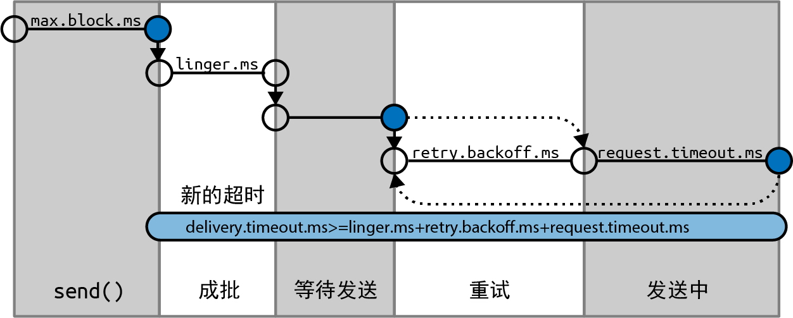

# 消息传递时间

从 Kafka 2.1 开始，我们**将 ProducerRecord 的发送时间分成如下两个时间间隔**，它们是被分开处理的：

1. **异步调用 send() 所花费的时间**。**在此期间，调用 send() 的线程将被阻塞。**
2. 从异步调用 send() 返回到触发回调（不管是成功还是失败）的时间，也就是**从 ProducerRecord 被放到批次中直到 Kafka 成功响应、出现不可恢复异常或发送超时的时间**。

<figure><figcaption></figcaption></figure>

## <mark style="color:blue;">**max.block.ms**</mark>

这个参数**用于控制在调用 send() 或通过 partitionsFor() 显式地请求元数据时生产者可以发生阻塞的时间。**

<mark style="color:orange;">**当生产者的发送缓冲区被填满或元数据不可用时，这些方法就可能发生阻塞**</mark>**。**当阻塞超过 max.block.ms 配置的时间时，就会抛出一个超时异常。

## <mark style="color:blue;">**delivery.timeout.ms**</mark>

**这个参数用于控制从消息准备好发送（send() 方法成功返回并将消息放入批次中）到 broker 响应或客户端放弃发送（包括重试）所花费的时间**。

> 如上图所示，**这个时间应该大于 linger.ms 和 request.timeout.ms。**
>
> 如果配置的时间不满足这一点，则会抛出异常。通常，成功发送消息的速度要比 **delivery.timeout.ms** 快得多。


<mark style="color:blue;">**可以将这个参数配置成你愿意等待的最长时间，通常是几分钟，并使用默认的重试次数（几乎无限制）。**</mark>基于这样的配置，只要生产者还有时间（在发送成功之前），它都会持续重试。


## <mark style="color:blue;">**request.timeout.ms**</mark>

这个参数用于**控制生产者在发送消息时等待服务器响应的时间**。

需要注意的是，**这是指生产者在放弃之前等待每个请求的时间，不包括重试、发送之前所花费的时间等。**如果设置的值已触及，但服务器没有响应，那么生产者将重试发送，或者执行回调，并传给它一个TimeoutException。

## <mark style="color:blue;">**retries**</mark>** 和 **<mark style="color:blue;">**retry.backoff.ms**</mark>

KafkaProducer 一般会出现两种错误：

* 一种是**可重试错误**，这种错误可以通过重发消息来解决。例如，对于连接错误，只要再次建立连接就可以解决；对于“not leader for partition”（非分区首领）错误，只要重新为分区选举首领就可以解决，此时元数据也会被刷新。
* 另一种错误则**无法通过重试解决**，比如“Message size too large”（消息太大）。对于这种错误，KafkaProducer 不会进行任何重试，而会立即抛出异常。

对于可重试错误，**retries 参数**可**用于控制生产者在放弃发送并向客户端宣告失败之前可以重试多少次**。在默认情况下，重试时间间隔是 100 毫秒，但可以**通过 retry.backoff.ms 参数来控制重试时间间隔**。


<mark style="color:orange;">**不建议在当前版本的 Kafka 中使用 retries 和 retry.backoff.ms 参数**</mark><mark style="color:orange;">。</mark>

<mark style="color:blue;">**可以测试一下 broker 在发生崩溃之后需要多长时间恢复（也就是直到所有分区都有了首领副本），并设置合理的 delivery.timeout.ms，让重试时间大于 Kafka 集群从崩溃中恢复的时间，以免生产者过早放弃重试。**</mark>


## <mark style="color:blue;">**linger.ms**</mark>

这个参数指定了**生产者在发送消息批次之前等待更多消息加入批次的时间**。生产者会在**批次被填满**或**等待时间达到 linger.ms** 时把消息批次发送出去。

在**默认情况（linger.ms=0）**下，只要有可用的发送者线程，生产者都会直接把批次发送出去，就算批次中只有一条消息。

**把 linger.ms 设置成比 0 大的数，可以让生产者在将批次发送给服务器之前等待一会儿，以使更多的消息加入批次中。虽然这样会增加一点儿延迟，但也极大地提升了吞吐量。**这是因为一次性发送的消息越多，每条消息的开销就越小，如果启用了压缩，则计算量也更少了。
