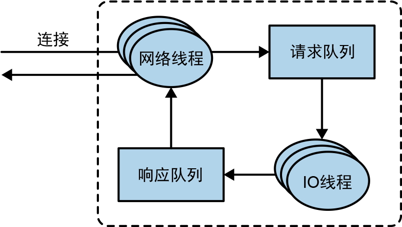

# 处理请求

<figure><figcaption></figcaption></figure>

<mark style="color:blue;">**broker 会在它监听的每一个端口上运行一个接收器线程**</mark>，这个线程会创建一个<mark style="color:blue;">**连接**</mark>，并把它交给处理器线程处理。处理器线程（也叫网络线程）的数量是可配置的。<mark style="color:blue;">**网络线程负责从客户端获取请求，把它们放进请求队列，然后从响应队列取出响应，把它们发送给客户端。**</mark>

**请求消息被放入请求队列后，IO 线程（也叫请求处理线程）会负责处理它们**。

> **联想：**
>
> 在 JUC 中，submit 一个任务后可以得到一个 Future，通过该 Future 即可获取到处理结果，任务被放置在了工作任务队列中，由工作者线程异步处理。

> 有时候，服务器端需要延迟对客户端做出响应，例如，消费者要求只在有可用数据时接收响应，或者发出 DeleteTopic 请求的客户端要求在开始删除主题之后才接收响应。
>
> **延迟的响应会被放在炼狱（临时内存）中，直到它们可以被发送给客户端。**


## 生产请求和获取请求都必须发送给分区的首领。

* 如果 broker 收到一个针对某个分区的**写入请求**，而这个分区的首领在另一个 broker 上，那么发送请求的客户端将收到<mark style="color:blue;">**“非分区首领”错误**</mark>响应。
* 如果针对某个分区的**读取请求**被发送到一个不包含这个分区首领的 broker 上，那么也会收到同样的错误。

**Kafka 客户端负责把生产请求和获取请求发送到包含分区首领的 broker 上。**



## 客户端怎么知道该向哪里发送请求呢？

客户端使用了另一种请求类型，也就是<mark style="color:blue;">**元数据请求**</mark>，请求中包含了客户端感兴趣的主题清单。**这种请求的响应消息里指明了这些主题所包含的分区、每个分区都有哪些副本，以及哪个副本是首领。**

> **元数据请求可以被发送给任意一个 broker，因为所有 broker 都缓存了这些元数据信息。**

一般情况下，<mark style="color:blue;">**客户端会把这些信息缓存起来，并直接向目标 broker 发送生产请求和获取请求**</mark>。

* 它们需要时不时地通过发送元数据请求来刷新缓存（刷新的时间间隔可以通过 **metadata.max.age.ms** 参数来配置），以便知道元数据是否发生了变化。
* **如果客户端收到“非分区首领”错误，那么它会在重新发送请求之前刷新元数据，因为这个错误说明客户端正在使用过期的元数据。**

