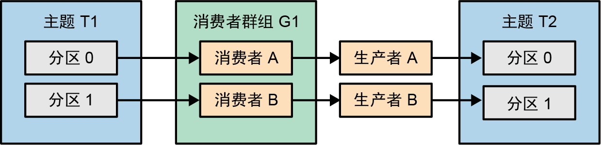

# 事务ID和隔离

<mark style="color:orange;">**一个应用程序实例的事务ID在重启前后必须保持一致，而且应用程序的不同实例的事务ID不能一样，否则broker将无法隔离“僵尸”实例。**</mark>

Kafka 2.5中引入了除事务ID之外的第二种基于消费者群组元数据的隔离方法(KIP-447)。我们会调用生产者的偏移量提交方法，并将消费者群组元数据（而不只是消费者群组ID）作为参数传给它。

假设主题T1有两个分区，分别是0和1。两个分区分别被同一消费者群组中的两个消费者消费，每个消费者都将消息传给对应的事务性生产者——一个事务ID为A，另一个事务ID为B，它们分别向主题T2的分区0和分区1写入结果。

<figure><figcaption></figcaption></figure>

如果消费者A和生产者A所在的应用程序实例变成“僵尸”，则消费者B将开始读取两个分区。

<figure><figcaption></figcaption></figure>

如果想保证不会有“僵尸”写入分区0，那么消费者B就不能读取分区0以及用事务ID B写入分区0。应用程序需要实例化一个事务ID为A的新生产者，该生产者可以安全地写入分区0，并隔离事务ID为A的旧生产者。

但这样做有点儿浪费，我们可以<mark style="color:blue;">**在事务中包含消费者群组信息**</mark>，生产者B的事务将显示它们来自新一代消费者群组，所以它们可以通过，而“僵尸”生产者A的事务将显示它们来自老一代消费者群组，所以它们将被隔离。
