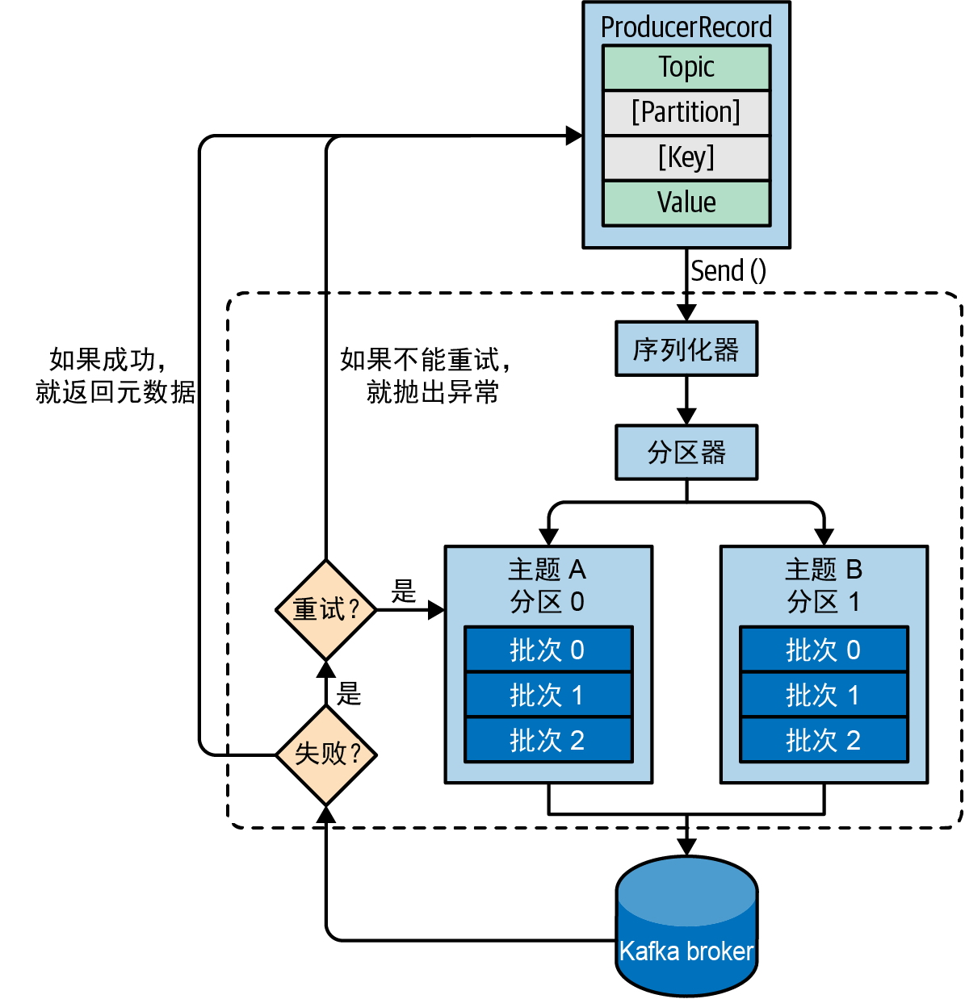

---
layout:
  title:
    visible: true
  description:
    visible: false
  tableOfContents:
    visible: true
  outline:
    visible: true
  pagination:
    visible: true
---

# 三、生产者（Producer）

### 3.1 概览

<div align="left" data-full-width="false">

<figure><figcaption></figcaption></figure>

</div>

**首先，创建一个ProducerRecord对象**，其中需要包含目标主题和要发送的内容。另外，还可以指定键、分区、时间戳或标头。**在发送ProducerRecord对象时，生产者需要先把键和值对象序列化成字节数组**，这样才能在网络上传输。

接下来，**如果没有显式地指定分区，那么数据将被传给分区器**。分区器通常会基于ProducerRecord对象的键选择一个分区。选好分区以后，生产者就知道该往哪个主题和分区发送这条消息了。紧接着，该消息会被添加到一个消息批次里，这个批次里的所有消息都将被发送给同一个主题和分区。**有一个独立的线程负责把这些消息批次发送给目标broker。**

broker在收到这些消息时会返回一个响应。

* 如果消息写入成功，就返回一个**RecordMetaData**对象，其中包含了主题和分区信息，以及消息在分区中的偏移量。
* 如果消息写入失败，则会返回一个错误。生产者在收到错误之后会尝试重新发送消息，重试几次之后如果还是失败，则会放弃重试，并返回错误信息。

### 3.2 创建Kafka生产者

要向Kafka写入消息，首先需要创建一个KafkaProducer对象，并设置一些属性。

#### 3.2.1 三个必须设置的属性

**1. bootstrap.servers**

broker的地址。可以由多个host:port组成，生产者用它们来建立初始的Kafka集群连接。

它不需要包含所有的broker地址，因为生产者在建立初始连接之后可以从给定的broker那里找到其他broker的信息。不过还是**建议至少提供两个broker地址**，因为一旦其中一个停机，则生产者仍然可以连接到集群。

**2. key.serializer**

一个类名，用来序列化消息的键。

broker希望接收到的消息的键和值都是字节数组。生产者可以把任意Java对象作为键和值发送给broker，但它需要知道如何把这些Java对象转换成字节数组。

> 需要注意的是，必须设置key.serializer这个属性，尽管你可能只需要将值发送给Kafka。如果只需要发送值，则可以将Void作为键的类型，然后将这个属性设置为VoidSerializer。

**3. value.serializer**

一个类名，用来序列化消息的值。

与设置key.serializer属性一样，需要将value.serializer设置成可以序列化消息值对象的类。

#### 3.2.2 消息传递时间

从Kafka 2.1开始，我们将ProduceRecord的发送时间分成如下两个时间间隔，它们是被分开处理的。

* 异步调用send()所花费的时间。在此期间，调用send()的线程将被阻塞。
* 从异步调用send()返回到触发回调（不管是成功还是失败）的时间，也就是从ProduceRecord被放到批次中直到Kafka成功响应、出现不可恢复异常或发送超时的时间。

<div align="left">

<figure><figcaption></figcaption></figure>

</div>

**1. max.block.ms**

这个参数用于控制在调用 send() 或通过 partitionsFor() 显式地请求元数据时生产者可以发生阻塞的时间。**当生产者的发送缓冲区被填满或元数据不可用时，这些方法就可能发生阻塞。**当达到max.block.ms配置的时间时，就会抛出一个超时异常。

**2. delivery.timeout.ms**

**这个参数用于控制从消息准备好发送（send()方法成功返回并将消息放入批次中）到broker响应或客户端放弃发送（包括重试）所花费的时间**。如上图所示，这个时间应该大于linger.ms和request.timeout.ms。如果配置的时间不满足这一点，则会抛出异常。通常，成功发送消息的速度要比delivery.timeout.ms快得多。

可以将这个参数配置成你愿意等待的最长时间，通常是几分钟，并使用默认的重试次数（几乎无限制）。基于这样的配置，只要生产者还有时间（或者在发送成功之前），它都会持续重试。

**3. request.timeout.ms**

这个参数用于控制生产者在发送消息时等待服务器响应的时间。需要注意的是，这是指生产者在放弃之前等待每个请求的时间，不包括重试、发送之前所花费的时间等。如果设置的值已触及，但服务器没有响应，那么生产者将重试发送，或者执行回调，并传给它一个TimeoutException。

**4. retries和retry.backoff.ms**

KafkaProducer一般会出现两种错误：

* 一种是可重试错误，这种错误可以通过重发消息来解决。例如，对于连接错误，只要再次建立连接就可以解决。对于“not leader for partition”（非分区首领）错误，只要重新为分区选举首领就可以解决，此时元数据也会被刷新。
* 另一种错误则无法通过重试解决，比如“Message size too large”（消息太大）。对于这种错误，KafkaProducer不会进行任何重试，而会立即抛出异常。

对于可重试错误，retries参数可用于控制生产者在放弃发送并向客户端宣告失败之前可以重试多少次。在默认情况下，重试时间间隔是100毫秒，但可以通过retry.backoff.ms参数来控制重试时间间隔。

> **不建议在当前版本的Kafka中使用这些参数**。相反，你**可以测试一下broker在发生崩溃之后需要多长时间恢复（也就是直到所有分区都有了首领副本），并设置合理的delivery.timeout.ms，让重试时间大于Kafka集群从崩溃中恢复的时间，以免生产者过早放弃重试。**

**5. linger.ms**

这个参数指定了**生产者在发送消息批次之前等待更多消息加入批次的时间**。生产者会在批次被填满或等待时间达到linger.ms时把消息批次发送出去。在默认情况下，只要有可用的发送者线程，生产者都会直接把批次发送出去，就算批次中只有一条消息。把linger.ms设置成比0大的数，可以让生产者在将批次发送给服务器之前等待一会儿，以使更多的消息加入批次中。虽然这样会增加一点儿延迟，但也极大地提升了吞吐量。这是因为一次性发送的消息越多，每条消息的开销就越小，如果启用了压缩，则计算量也更少了。

#### 3.2.3 其他属性

**1. client.id**

client.id是客户端标识符，它的值可以是任意字符串，broker用它来识别从客户端发送过来的消息。client.id可以被用在日志、指标和配额中。

**2. acks**

acks指定了生产者在多少个同步分区副本收到消息的情况下才会认为消息写入成功。

* 如果**acks=0**，则**生产者不会等待任何来自broker的响应**。也就是说，如果broker因为某些问题没有收到消息，那么生产者便无从得知，消息也就丢失了。不过，因为生产者不需要等待broker返回响应，所以它们能够以网络可支持的最大速度发送消息，从而达到很高的吞吐量。
* 如果**acks=1**，那么**只要集群的首领副本收到消息，生产者就会收到消息成功写入的响应**。如果消息无法到达首领副本（比如首领副本发生崩溃，新首领还未选举出来），那么生产者会收到一个错误响应。为了避免数据丢失，生产者会尝试重发消息。不过，在首领副本发生崩溃的情况下，如果消息还没有被复制到新的首领副本，则消息还是有可能丢失。
* 如果**acks=all**，那么**只有当所有同步副本全部收到消息时，生产者才会收到消息成功写入的响应**。这种模式是最安全的，它可以保证不止一个broker收到消息，就算有个别broker发生崩溃，整个集群仍然可以运行。

> 为acks设置的值越小，生产者发送消息的速度就越快。也就是说，我们通过牺牲可靠性来换取较低的生产者延迟。
>
> 不过，**端到端延迟是指从消息生成到可供消费者读取的时间，这对3种配置来说都是一样的**。这是因为为了保持一致性，**在消息被写入所有同步副本之前，Kafka不允许消费者读取它们**。因此，如果你关心的是端到端延迟，而不是生产者延迟，那么就不需要在可靠性和低延迟之间做权衡了：你可以选择最可靠的配置，但仍然可以获得相同的端到端延迟。

**3. batch.size**

当有多条消息被发送给同一个分区时，生产者会把它们放在同一个批次里。这个参数指定了**一个批次可以使用的内存大小**。需要注意的是，该参数是按照字节数而不是消息条数来计算的。当批次被填满时，批次里所有的消息都将被发送出去。

**4. max.in.flight.requests.per.connection**

这个参数指定了**生产者在收到服务器响应之前可以发送多少个消息批次**。它的值越大，占用的内存就越多，不过吞吐量也会得到提升。Apache wiki页面上的实验数据表明，在单数据中心环境中，该参数被设置为2时可以获得最佳的吞吐量，但使用默认值5也可以获得差不多的性能。

> 假设我们把retries设置为非零的整数，并把max.in.flight.requests.per.connection设置为比1大的数。如果第一个批次写入失败，第二个批次写入成功，那么broker会重试写入第一个批次，等到第一个批次也写入成功，两个批次的顺序就反过来了。
>
> 我们希望至少有2个正在处理中的请求（出于性能方面的考虑），并且可以进行多次重试（出于可靠性方面的考虑），这个时候，最好的解决方案是将enable.idempotence设置为true。这样就可以在最多有5个正在处理中的请求的情况下保证顺序，并且可以保证重试不会引入重复消息。

**5. enable.idempotence**

从0.11版本开始，Kafka支持精确一次性(exactly once)语义。

> 假设为了最大限度地提升可靠性，你将生产者的acks设置为all，并将delivery.timeout.ms设置为一个比较大的数，允许进行尽可能多的重试。这些配置可以确保每条消息被写入Kafka至少一次。但在某些情况下，消息有可能被写入Kafka不止一次。假设一个broker收到了生产者发送的消息，然后消息被写入本地磁盘并成功复制给了其他broker。此时，这个broker还没有向生产者发送响应就发生了崩溃。而生产者将一直等待，直到达到request.timeout.ms，然后进行重试。重试发送的消息将被发送给新的首领，而这个首领已经有这条消息的副本，因为之前写入的消息已经被成功复制给它了。现在，你就有了一条重复的消息。
>
> **为了避免这种情况，可以将enable.idempotence设置为true。当幂等生产者被启用时，生产者将给发送的每一条消息都加上一个序列号。如果broker收到具有相同序列号的消息，那么它就会拒绝第二个副本，而生产者则会收到DuplicateSequenceException**，这个异常对生产者来说是无害的。
>
> **如果要启用幂等性，那么max.in.flight.requests.per.connection应小于或等于5、retries应大于0，并且acks被设置为all。**如果设置了不恰当的值，则会抛出ConfigException异常。

**6. buffer.memory**

这个参数用来设置生产者用来暂存消息的**内存缓冲区**大小。**如果应用程序调用send()方法的速度超过生产者将消息发送给服务器的速度，那么生产者的缓冲空间可能会被耗尽，后续的send()方法调用会等待内存空间被释放，如果在max.block.ms之后还没有可用空间，就抛出异常。**需要注意的是，这个异常与其他异常不一样，它是send()方法而不是Future对象抛出来的。

**7. compression.type**

在默认情况下，生产者发送的消息是未经压缩的。这个参数可以被设置为snappy、gzip、lz4或zstd，这指定了消息被发送给broker之前使用哪一种压缩算法。

**8. max.request.size**

这个参数用于控制生产者发送的请求的大小。它限制了可发送的**单条最大消息**的大小和**单个请求的消息总量**的大小。假设这个参数的值为1MB，那么可发送的单条最大消息就是1 MB，或者生产者最多可以在单个请求里发送一条包含1024个大小为1 KB的消息。另外，broker对可接收的最大消息也有限制(message.max.bytes)，其两边的配置最好是匹配的，以免生产者发送的消息被broker拒绝。

**9. receive.buffer.bytes和send.buffer.bytes**

这两个参数分别指定了**TCP socket接收和发送数据包的缓冲区大小**。如果它们被设为–1，就使用操作系统默认值。如果生产者或消费者与broker位于不同的数据中心，则可以适当加大它们的值，因为跨数据中心网络的延迟一般都比较高，而带宽又比较低。

### 3.3 消息的发送方式

#### 1. 发送并忘记

把消息发送给服务器，但并不关心它是否成功送达。

大多数情况下，消息可以成功送达，因为Kafka是高可用的，而且生产者有自动尝试重发的机制。但是，**如果发生了不可重试的错误或超时，那么消息将会丢失，应用程序将不会收到任何信息或异常。**

#### 2. 同步发送

调用send()方法发送消息，它会返回一个Future对象。可以调用get()方法等待Future完成，这样就可以在发送下一条消息之前知道当前消息是否发送成功。

#### 3. 异步发送

调用send()方法，并指定一个**回调函数**，当服务器返回响应时，这个函数会被触发。

> **回调的执行将在生产者主线程中进行**，如果有两条消息被发送给同一个分区，则这可以保证它们的回调是按照发送的顺序执行的。这就要求回调的执行要快，避免生产者出现延迟或影响其他消息的发送。不建议在回调中执行阻塞操作，阻塞操作应该被放在其他线程中执行。

### 3.4 分区

**Kafka消息就是一个个的键–值对**，ProducerRecord对象可以只包含主题名称和值，键默认情况下是null。不过，大多数应用程序还是会用键来发送消息。键有两种用途：一是作为消息的附加信息与消息保存在一起，二是用来确定消息应该被写入主题的哪个分区。

**如果键为null，并且使用了默认的分区器，那么记录将被随机发送给主题的分区**。分区器使用**轮询调度(round-robin)算法**将消息均衡地分布到各个分区中。从Kafka 2.4开始，**在处理键为null的记录时，默认分区器使用的轮询调度算法具备了黏性**。也就是说，**在切换到下一个分区之前，它会将同一个批次的消息全部写入当前分区。**这样就可以使用更少的请求发送相同数量的消息，既降低了延迟，又减少了broker占用CPU的时间。

如果键不为空且使用了默认的分区器，那么Kafka会对键进行哈希（使用Kafka自己的哈希算法，即使升级Java版本，哈希值也不会发生变化），然后根据哈希值把消息映射到特定的分区。这里的关键在于同一个键总是被映射到同一个分区，所以**在进行映射时，会用到主题所有的分区，而不只是可用的分区**。这也意味着，如果在写入数据时目标分区不可用，那么就会出错。

除了默认的分区器，Kafka客户端还提供了**RoundRobinPartitioner**和**UniformStickyPartitioner**。在消息包含键的情况下，可以用它们来实现**随机分区**分配和**黏性随机**分区分配。对某些应用程序（例如，ETL应用程序会将数据从Kafka加载到关系数据库中，并使用Kafka记录的键作为数据库的主键）来说，键很重要，但如果负载出现了倾斜，那么其中某些键就会对应较大的负载。这个时候，**可以用UniformStickyPartitioner将负载均衡地分布到所有分区。**

### 3.5 标头

除了键和值，记录还可以包含标头。可以在不改变记录键–值对的情况下向标头中添加一些有关记录的元数据。标头指明了记录数据的来源，**可以在不解析消息体的情况下根据标头信息来路由或跟踪消息**（消息有可能被加密，而路由器没有访问加密数据的权限）。

标头由一系列有序的键–值对组成。键是字符串，值可以是任意被序列化的对象，就像消息里的值一样。

### 3.6 拦截器

有时候，你希望**在不修改代码的情况下改变Kafka客户端的行为**。这或许是因为你想给公司所有的应用程序都加上同样的行为，或许是因为无法访问应用程序的原始代码。

**常见的生产者拦截器应用场景包括：捕获监控和跟踪信息、为消息添加标头，以及敏感信息脱敏。**

Kafka的ProducerInterceptor拦截器包含两个关键方法：

* `ProducerRecord<K, V> onSend(ProducerRecord<K, V>record)`：这个方法会在记录被发送给Kafka之前，甚至是在记录被序列化之前调用。如果覆盖了这个方法，那么你就可以捕获到有关记录的信息，甚至可以修改它。只需确保这个方法返回一个有效的ProducerRecord对象。这个方法返回的记录将被序列化并发送给Kafka。
* `void onAcknowledgement(RecordMetadata metadata,Exception exception)`：这个方法会在收到Kafka的确认响应时调用。覆盖这个方法时，不可以修改Kafka返回的响应，但可以捕获到有关响应的信息。

可以在不修改客户端代码的情况下使用生产者拦截器。如果要在kafka-console-producer 中使用上述的拦截器，那么可以遵循以下3个步骤：

1.  将jar包加入类路径中。

    ```
      
      export CLASSPATH=$CLASSPATH:~./target/CountProducerInterceptor-1.0-
      SNAPSHOT.jar
    ```
2.  创建一个包含这些信息的配置文件producer.config。

    ```
      
      interceptor.classes=com.shapira.examples.interceptors.CountProducer
      Interceptor counting.interceptor.window.size.ms=10000
    ```
3.  正常运行应用程序，但要指定上一步创建的配置文件。

    ```
      
      bin/kafka-console-producer.sh --broker-list localhost:9092 --topic
      interceptor-test --producer.config producer.config
    ```

### 3.7 配额和节流

Kafka可以限制生产消息和消费消息的速率，这是通过配额机制来实现的。**Kafka提供了3种配额类型：生产、消费和请求**。生产配额和消费配额限制了客户端发送和接收数据的速率（以字节 / 秒为单位）。请求配额限制了broker用于处理客户端请求的时间百分比。

可以为所有客户端（使用默认配额）、特定客户端、特定用户，或特定客户端及特定用户设置配额。特定用户的配额只在集群配置了安全特性并对客户端进行了身份验证后才有效。

默认的生产配额和消费配额是broker配置文件的一部分。如果要限制每个生产者平均发送的消息不超过2 MBps，那么可以在broker配置文件中加入quota.producer.default=2M。

也可以覆盖broker配置文件中的默认配额来为某些客户端配置特定的配额，尽管**不建议这么做**。如果允许clientA的配额达到4 MBps、clientB的配额达到10 MBps，则可以这样配置：quota.producer.override="clientA:4M,clientB:10M"。

**在配置文件中指定的配额都是静态的，如果要修改它们，则需要重启所有的broker。**因为随时都可能有新客户端加入，所以这种配置方式不是很方便。因此，特定客户端的配额通常采用动态配置。可以用kafka-config.sh或AdminClient API来动态设置配额。

```
  
  # 限制clientC（通过客户端ID来识别）每秒平均发送不超过1024字节。
  bin/kafka-configs --bootstrap-server localhost:9092 --alter --add-config 'producer_
  byte_rate=1024' --entity-name clientC --entity-type clients 
  ​
  # 限制user1（通过已认证的账号来识别）每秒平均发送不超过1024字节以及每秒平均消费不超过2048字节。
  bin/kafka-configs --bootstrap-server localhost:9092 --alter --add-config 'producer_
  byte_rate=1024,consumer_byte_rate=2048' --entity-name user1 --entity-type users
  ​
  # 限制所有用户每秒平均消费不超过2048字节，有覆盖配置的特定用户除外。这也是动态修改默认配置的一种方式。
  bin/kafka-configs --bootstrap-server localhost:9092 --alter --add-config 'consumer_
  byte_rate=2048' --entity-type users
```

当客户端触及配额时，broker会开始限制客户端请求，以防止超出配额。这意味着broker将延迟对客户端请求做出响应。对大多数客户端来说，这样会自动降低请求速率（因为执行中的请求数量也是有限制的），并将客户端流量降到配额允许的范围内。但是，被节流的客户端还是有可能向服务器端发送额外的请求，为了不受影响，**broker将在一段时间内暂停与客户端之间的通信通道，以满足配额要求**。

节流行为通过produce-throttle-time-avg、produce-throttle-time-max、fetch-throttle-time-avg和fetch-throttle-time-max暴露给客户端，这几个参数是生产请求和消费请求因节流而被延迟的平均时间和最长时间。需要注意的是，这些时间对应的是生产消息和消费消息的吞吐量配额、请求时间配额，或两者兼而有之。其他类型的客户端请求只会因触及请求时间配额而被节流，这些节流行为也会通过其他类似的指标暴露出来。

> **如果你异步调用Producer.send()，并且发送速率超过了broker能够接受的速率**（无论是由于配额的限制还是由于处理能力不足），那么消息将会被放入客户端的内存队列。如果发送速率一直快于接收速率，那么客户端最终将耗尽内存缓冲区，并阻塞后续的Producer.send()调用。如果超时延迟不足以让broker赶上生产者，使其清理掉一些缓冲区空间，那么Producer.send()最终将抛出TimeoutException异常。或者，批次里的记录因为等待时间超过了delivery.timeout.ms而过期，导致执行send()的回调，并抛出TimeoutException异常。因此，要做好计划和监控，确保broker的处理能力总是与生产者发送数据的速率相匹配。
