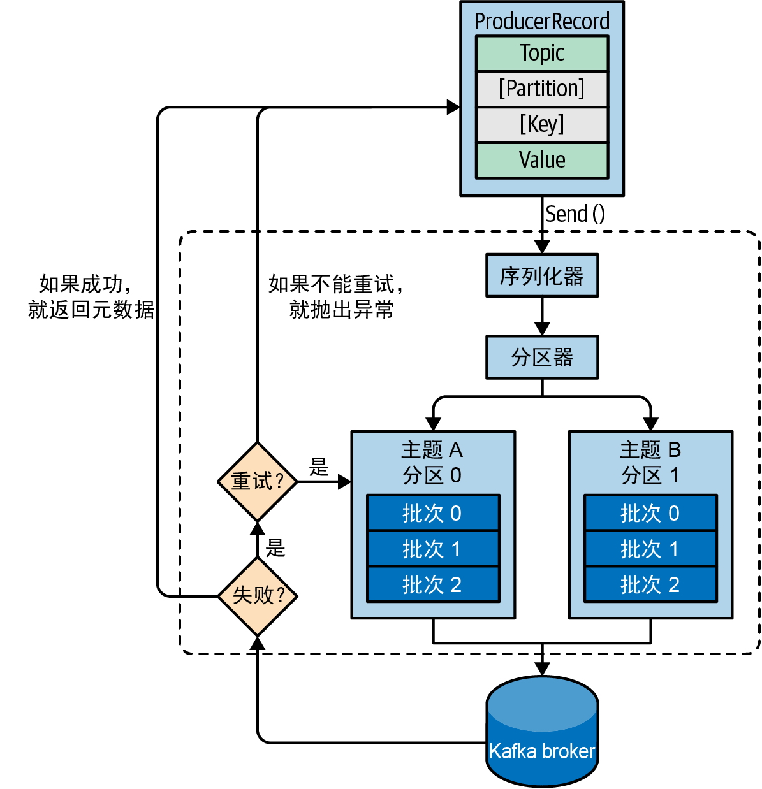

# 3.1 概览

<figure><figcaption></figcaption></figure>

**首先，创建一个**<mark style="color:blue;">**ProducerRecord**</mark>**对象**，其中需要包含目标主题和要发送的内容。另外，还可以指定键、分区、时间戳或标头。**在发送ProducerRecord对象时，生产者需要先把键和值对象**<mark style="color:blue;">**序列化**</mark>**成字节数组**，这样才能在网络上传输。

接下来，**如果没有显式地指定分区，那么数据将被传给**<mark style="color:blue;">**分区器**</mark>。分区器通常会基于ProducerRecord对象的键选择一个分区。选好分区以后，生产者就知道该往哪个主题和分区发送这条消息了。紧接着，该消息会被添加到一个<mark style="color:blue;">**消息批次**</mark>里，**这个批次里的所有消息都将被发送给同一个主题和分区**。<mark style="color:red;">**有一个独立的线程负责把这些消息批次发送给目标broker。**</mark>

broker在收到这些消息时会返回一个响应。

* 如果消息写入成功，就返回一个<mark style="color:blue;">**RecordMetaData**</mark>对象，其中**包含了主题和分区信息，以及消息在分区中的偏移量**。
* 如果消息写入失败，则会返回一个错误。生产者在收到错误之后会尝试重新发送消息，**重试**几次之后如果还是失败，则会放弃重试，并返回错误信息。
