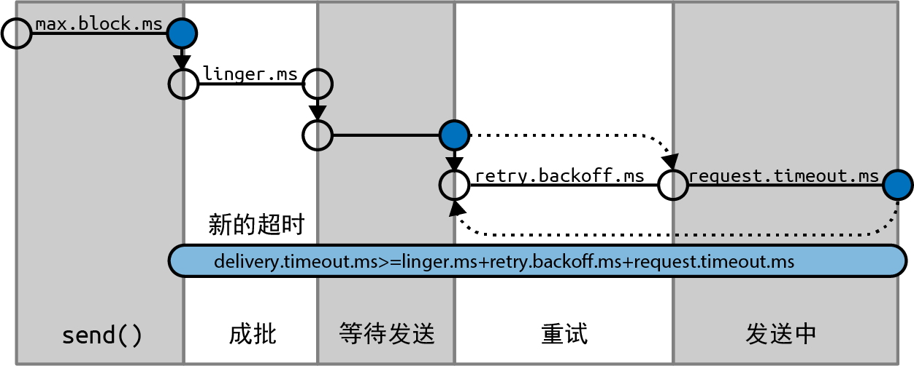

# 3.2 创建Kafka生产者

要向Kafka写入消息，首先需要创建一个<mark style="color:blue;">**KafkaProducer**</mark>对象，并设置一些属性。

## 3.2.1 三个必须设置的属性

## **1. bootstrap.servers**

broker的地址。可以由多个host:port组成，生产者用它们来建立初始的Kafka集群连接。

它不需要包含所有的broker地址，因为生产者在建立初始连接之后可以从给定的broker那里找到其他broker的信息。不过还是**建议至少提供两个broker地址**，因为一旦其中一个停机，则生产者仍然可以连接到集群。

### **2. key.serializer**

一个类名，用来序列化消息的键。

broker希望接收到的消息的键和值都是字节数组。生产者可以把任意Java对象作为键和值发送给broker，但它需要知道如何把这些Java对象转换成字节数组。


需要注意的是，必须设置key.serializer这个属性，尽管你可能只需要将值发送给Kafka。如果只需要发送值，则可以将Void作为键的类型，然后将这个属性设置为VoidSerializer。


### **3. value.serializer**

一个类名，用来序列化消息的值。

与设置key.serializer属性一样，需要将value.serializer设置成可以序列化消息值对象的类。

## 3.2.2 消息传递时间

从Kafka 2.1开始，我们将ProduceRecord的发送时间分成如下两个时间间隔，它们是被分开处理的。

* 异步调用send()所花费的时间。在此期间，调用send()的线程将被阻塞。
* 从异步调用send()返回到触发回调（不管是成功还是失败）的时间，也就是从ProduceRecord被放到批次中直到Kafka成功响应、出现不可恢复异常或发送超时的时间。

<figure><figcaption></figcaption></figure>

### **1. max.block.ms**

这个参数用于控制在调用 send() 或通过 partitionsFor() 显式地请求元数据时生产者可以发生阻塞的时间。<mark style="color:red;">**当生产者的发送缓冲区被填满或元数据不可用时，这些方法就可能发生阻塞**</mark>**。**当达到max.block.ms配置的时间时，就会抛出一个超时异常。

### **2. delivery.timeout.ms**

**这个参数用于控制从消息准备好发送（send()方法成功返回并将消息放入批次中）到broker响应或客户端放弃发送（包括重试）所花费的时间**。如上图所示，这个时间应该大于linger.ms和request.timeout.ms。如果配置的时间不满足这一点，则会抛出异常。通常，成功发送消息的速度要比delivery.timeout.ms快得多。

可以将这个参数配置成你愿意等待的最长时间，通常是几分钟，并使用默认的重试次数（几乎无限制）。基于这样的配置，只要生产者还有时间（或者在发送成功之前），它都会持续重试。

### **3. request.timeout.ms**

这个参数用于控制生产者在发送消息时等待服务器响应的时间。需要注意的是，这是指生产者在放弃之前等待每个请求的时间，不包括重试、发送之前所花费的时间等。如果设置的值已触及，但服务器没有响应，那么生产者将重试发送，或者执行回调，并传给它一个TimeoutException。

### **4. retries和retry.backoff.ms**

KafkaProducer一般会出现两种错误：

* 一种是可重试错误，这种错误可以通过重发消息来解决。例如，对于连接错误，只要再次建立连接就可以解决。对于“not leader for partition”（非分区首领）错误，只要重新为分区选举首领就可以解决，此时元数据也会被刷新。
* 另一种错误则无法通过重试解决，比如“Message size too large”（消息太大）。对于这种错误，KafkaProducer不会进行任何重试，而会立即抛出异常。

对于可重试错误，retries参数可用于控制生产者在放弃发送并向客户端宣告失败之前可以重试多少次。在默认情况下，重试时间间隔是100毫秒，但可以通过retry.backoff.ms参数来控制重试时间间隔。


**不建议在当前版本的Kafka中使用这些参数**。相反，你<mark style="color:red;">**可以测试一下broker在发生崩溃之后需要多长时间恢复（也就是直到所有分区都有了首领副本），并设置合理的delivery.timeout.ms，让重试时间大于Kafka集群从崩溃中恢复的时间，以免生产者过早放弃重试。**</mark>


### **5. linger.ms**

这个参数指定了<mark style="color:blue;">**生产者在发送消息批次之前等待更多消息加入批次的时间**</mark>。生产者会在批次被填满或等待时间达到linger.ms时把消息批次发送出去。在默认情况下，只要有可用的发送者线程，生产者都会直接把批次发送出去，就算批次中只有一条消息。把linger.ms设置成比0大的数，可以让生产者在将批次发送给服务器之前等待一会儿，以使更多的消息加入批次中。虽然这样会增加一点儿延迟，但也极大地提升了吞吐量。这是因为一次性发送的消息越多，每条消息的开销就越小，如果启用了压缩，则计算量也更少了。

## 3.2.3 其他属性

### **1. client.id**

client.id是客户端标识符，它的值可以是任意字符串，broker用它来识别从客户端发送过来的消息。client.id可以被用在日志、指标和配额中。

### **2. acks**

acks指定了生产者在多少个同步分区副本收到消息的情况下才会认为消息写入成功。

* 如果<mark style="color:blue;">**acks=0**</mark>，则**生产者不会等待任何来自broker的响应**。也就是说，如果broker因为某些问题没有收到消息，那么生产者便无从得知，消息也就丢失了。不过，因为生产者不需要等待broker返回响应，所以它们能够以网络可支持的最大速度发送消息，从而达到很高的吞吐量。
* 如果<mark style="color:blue;">**acks=1**</mark>，那么**只要集群的首领副本收到消息，生产者就会收到消息成功写入的响应**。如果消息无法到达首领副本（比如首领副本发生崩溃，新首领还未选举出来），那么生产者会收到一个错误响应。为了避免数据丢失，生产者会尝试重发消息。不过，在首领副本发生崩溃的情况下，如果消息还没有被复制到新的首领副本，则消息还是有可能丢失。
* 如果<mark style="color:blue;">**acks=all**</mark>，那么**只有当所有同步副本全部收到消息时，生产者才会收到消息成功写入的响应**。这种模式是最安全的，它可以保证不止一个broker收到消息，就算有个别broker发生崩溃，整个集群仍然可以运行。


为acks设置的值越小，生产者发送消息的速度就越快。也就是说，我们通过牺牲可靠性来换取较低的生产者延迟。

不过，<mark style="color:blue;">**端到端延迟是指从消息生成到可供消费者读取的时间，这对3种配置来说都是一样的**</mark><mark style="color:blue;">。</mark>这是因为为了保持一致性，<mark style="color:blue;">**在消息被写入所有同步副本之前，Kafka不允许消费者读取它们**</mark><mark style="color:blue;">。</mark>因此，如果你关心的是端到端延迟，而不是生产者延迟，那么就不需要在可靠性和低延迟之间做权衡了：你可以选择最可靠的配置，但仍然可以获得相同的端到端延迟。


### **3. batch.size**

当有多条消息被发送给同一个分区时，生产者会把它们放在同一个批次里。这个参数指定了**一个批次可以使用的内存大小**。需要注意的是，该参数是按照字节数而不是消息条数来计算的。当批次被填满时，批次里所有的消息都将被发送出去。

### **4. max.in.flight.requests.per.connection**

这个参数指定了**生产者在收到服务器响应之前可以发送多少个消息批次**。它的值越大，占用的内存就越多，不过吞吐量也会得到提升。Apache wiki页面上的实验数据表明，在单数据中心环境中，该参数被设置为2时可以获得最佳的吞吐量，但使用默认值5也可以获得差不多的性能。


假设我们把retries设置为非零的整数，并把max.in.flight.requests.per.connection设置为比1大的数。如果第一个批次写入失败，第二个批次写入成功，那么broker会重试写入第一个批次，等到第一个批次也写入成功，两个批次的顺序就反过来了。

我们希望至少有2个正在处理中的请求（出于性能方面的考虑），并且可以进行多次重试（出于可靠性方面的考虑），这个时候，最好的解决方案是将**enable.idempotence**设置为**true**。这样就可以在最多有5个正在处理中的请求的情况下保证顺序，并且可以保证重试不会引入重复消息。


### **5. enable.idempotence**

从0.11版本开始，Kafka支持精确一次性(exactly once)语义。


假设为了最大限度地提升可靠性，你将生产者的acks设置为all，并将delivery.timeout.ms设置为一个比较大的数，允许进行尽可能多的重试。这些配置可以确保每条消息被写入Kafka至少一次。但在某些情况下，消息有可能被写入Kafka不止一次。<mark style="color:orange;">假设一个broker收到了生产者发送的消息，然后消息被写入本地磁盘并成功复制给了其他broker。此时，这个broker还没有向生产者发送响应就发生了崩溃。而生产者将一直等待，直到达到request.timeout.ms，然后进行重试。重试发送的消息将被发送给新的首领，而这个首领已经有这条消息的副本，因为之前写入的消息已经被成功复制给它了。现在，你就有了一条重复的消息。</mark>

<mark style="color:red;">**为了避免这种情况，可以将enable.idempotence设置为true。当幂等生产者被启用时，生产者将给发送的每一条消息都加上一个序列号。如果broker收到具有相同序列号的消息，那么它就会拒绝第二个副本，而生产者则会收到DuplicateSequenceException**</mark><mark style="color:red;">，</mark>这个异常对生产者来说是无害的。

<mark style="color:red;">**如果要启用幂等性，那么max.in.flight.requests.per.connection应小于或等于5、retries应大于0，并且acks被设置为all**</mark>**。**如果设置了不恰当的值，则会抛出ConfigException异常。


### **6. buffer.memory**

这个参数用来设置生产者用来暂存消息的**内存缓冲区**大小。<mark style="color:blue;">**如果应用程序调用send()方法的速度超过生产者将消息发送给服务器的速度，那么生产者的缓冲空间可能会被耗尽，后续的send()方法调用会等待内存空间被释放，如果在max.block.ms之后还没有可用空间，就抛出异常**</mark>**。**需要注意的是，这个异常与其他异常不一样，它是send()方法而不是Future对象抛出来的。

### **7. compression.type**

在默认情况下，生产者发送的消息是未经压缩的。这个参数可以被设置为snappy、gzip、lz4或zstd，这指定了消息被发送给broker之前使用哪一种压缩算法。

### **8. max.request.size**

这个参数用于控制生产者发送的请求的大小。它限制了可发送的**单条最大消息**的大小和**单个请求的消息总量**的大小。假设这个参数的值为1MB，那么可发送的单条最大消息就是1 MB，或者生产者最多可以在单个请求里发送一条包含1024个大小为1 KB的消息。另外，broker对可接收的最大消息也有限制(message.max.bytes)，其两边的配置最好是匹配的，以免生产者发送的消息被broker拒绝。

### **9. receive.buffer.bytes和send.buffer.bytes**

这两个参数分别指定了**TCP socket接收和发送数据包的缓冲区大小**。如果它们被设为–1，就使用操作系统默认值。如果生产者或消费者与broker位于不同的数据中心，则可以适当加大它们的值，因为跨数据中心网络的延迟一般都比较高，而带宽又比较低。
