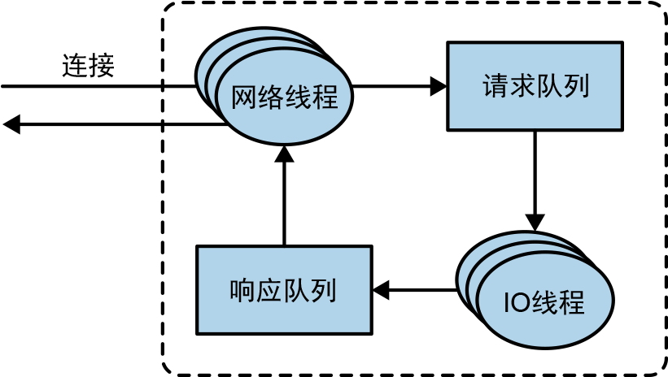

# 五、深入Kafka

### 5.1 集群的成员关系

Kafka使用ZooKeeper维护集群的成员信息。每个broker都有一个唯一的标识符，这个标识符既可以在配置文件中指定，也可以自动生成。**broker在启动时通过创建ZooKeeper 临时节点把自己的ID注册到ZooKeeper中**。broker、控制器和其他的一些生态系统工具会订阅ZooKeeper的 /brokers/ids路径（也就是broker在ZooKeeper上的注册路径），当有broker加入或退出集群时，它们可以收到通知。

当broker与ZooKeeper断开连接（通常会在关闭broker时发生，但在发生网络分区或长时间垃圾回收停顿时也会发生）时，它在启动时创建的临时节点会自动从ZooKeeper上移除。监听broker节点路径的Kafka组件会被告知这个broker已被移除。

broker对应的ZooKeeper节点会在broker被关闭之后消失，但它的ID会**继续存在于其他数据结构**中。例如，每个主题的副本集中就可能包含这个ID。在完全关闭一个broker后，如果使用相同的ID启动另一个全新的broker，则它会立即加入集群，并获得与之前相同的分区和主题。

#### 5.1.1 控制器

控制器其实也是一个broker，只不过除了提供一般的broker功能之外，它还**负责选举分区首领**。集群中第一个启动的broker会通过在ZooKeeper中创建一个名为 /controller的临时节点让自己成为控制器。其他broker在启动时也会尝试创建这个节点，但它们会收到“节点已存在”异常，并“意识”到控制器节点已存在，也就是说集群中已经有一个控制器了。其他broker会在控制器节点上创建ZooKeeper　watch，这样就可以收到这个节点的变更通知了。我们通过这种方式来确保集群中只有一个控制器。

如果控制器被关闭或者与ZooKeeper断开连接，那么这个临时节点就会消失。控制器使用的ZooKeeper客户端没有在zookeeper.session.timeout.ms指定的时间内向ZooKeeper发送心跳是导致连接断开的原因之一。当临时节点消失时，集群中的其他broker将收到控制器节点已消失的通知，并尝试让自己成为新的控制器。

**每个新选出的控制器都会通过ZooKeeper条件递增操作获得一个数值更大的epoch**。其他broker也会知道当前控制器的epoch，如果收到由控制器发出的包含较小epoch的消息，就会忽略它们。这一点很重要，因为控制器会因长时间垃圾回收停顿与ZooKeeper断开连接——在停顿期间，新控制器将被选举出来。当旧控制器在停顿之后恢复时，它并不知道已经选出了新的控制器，并会继续发送消息——在这种情况下，旧控制器会被认为是一个“僵尸控制器”。**消息里的epoch可以用来忽略来自旧控制器的消息，这是防御“僵尸”的一种方式**。

**控制器必须先从ZooKeeper加载最新的副本集状态，然后才能开始管理集群元数据和执行首领选举**。这个加载过程使用了异步API，为了减少延迟，请求会以管道的形式发送给ZooKeeper。但即便如此，**在有大量分区的集群中，加载过程可能仍然需要几秒**。

当控制器发现有一个broker离开了集群时，原先首领位于这个broker上的所有分区需要一个新首领。它将遍历所有需要新首领的分区，并决定应该将哪个副本作为新首领。然后，它会将更新后的状态持久化到ZooKeeper中，再向所有包含这些分区副本的broker发送一个LeaderAndISR请求，请求中包含了新首领和跟随者的信息。出于效率方面的考虑，这些请求会被分成批次，所以每个请求都包含了多个分区最新的成员关系信息。每一个新首领都知道自己要开始处理来自生产者和消费者的请求，而跟随者也知道它们要开始从新首领那里复制消息。

集群中的每一个broker都有一个MetadataCache，其中包含了一个保存所有broker和副本信息的map。控制器通过UpdateMetadata请求向所有broker发送有关首领变更的信息，broker会在收到请求后更新缓存。在启动broker副本时也会有类似的过程——主要的区别是broker所有的分区副本都是跟随者，并且需要在自己有资格被选为首领之前与首领保持同步。

总的来说，**Kafka会使用ZooKeeper的临时节点来选举控制器，并会在broker加入或退出集群时通知控制器。控制器负责在broker加入或退出集群时进行首领选举。控制器会使用epoch来避免“脑裂”。**所谓的“脑裂”，就是指两个broker同时认为自己是集群当前的控制器。

#### 5.1.2 复制

复制是Kafka架构核心的一部分。Kafka经常被描述成“一个分布式、分区、可复制的提交日志服务”。复制之所以这么重要，是因为它可以在个别节点失效时仍能保证Kafka的可用性和持久性。

**Kafka的数据保存在主题中，每个主题被分成若干个分区，每个分区可以有多个副本。副本保存在broker上，每个broker可以保存成百上千个主题和分区的副本。**

副本有以下两种类型：

* **首领副本**

每个分区都有一个首领副本。**为了保证一致性，所有生产者请求和消费者请求都会经过这个副本**。客户端可以从首领副本或跟随者副本读取数据。

* **跟随者副本**

首领以外的副本都是跟随者副本。**如果没有特别指定，则跟随者副本将不处理来自客户端的请求，它们的主要任务是从首领那里复制消息，保持与首领一致的状态**。如果首领发生崩溃，那么其中的一个跟随者就会被提拔为新首领。

> 从跟随者副本读取数据：
>
> 这个特性的主要目的是允许客户端从最近的同步副本而不是首领副本读取数据，以此来降低网络流量成本。
>
> 要使用这个特性：
>
> * 消费者端需要配置可以标识客户端位置的client.rack。
> * broker端需要配置replica.selector.class，把它设置为RackAwareReplicaSelector。它将选择一个**最近的副本，这个副本所在的broker的rack.id与客户端配置的client.rack相匹配**。默认为LeaderSelector，表示总是从首领副本读取数据。
>
> 复制协议经过了扩展，保证**从跟随者副本读取的消息都是已提交的**。也就是说，即使是从跟随者副本读取数据，仍然可以获得与之前一样的可靠性保证。为了提供这种保证，所有副本都需要知道首领提交了哪些消息。**为此，首领在发送给跟随者的数据中加入了当前高水位标记（最近提交的偏移量）**。**传输高水位标记会导致一些延迟，也就是说，从跟随者副本读取到可用数据将比从首领副本读取晚一些**。如果要减少消费者延迟，则需要从首领副本读取数据。

首领的另一项任务是搞清楚哪些跟随者副本的状态与自己是一致的。为了保持与首领同步，跟随者会尝试从首领那里复制消息，但它们可能会因为各种原因无法与首领保持同步。

**为了与首领保持同步，跟随者需要向首领发送Fetch请求，这与消费者为了读取消息而发送的请求是一样的**。作为响应，首领会将消息返回给跟随者。Fetch请求消息里包含了跟随者想要获取的消息的偏移量，这些偏移量总是有序的。这样，首领就可以知道一个副本是否已经获取了最近一条消息之前的所有消息。通过检查每个副本请求的最后一个偏移量，首领就可以知道每个副本的滞后程度。如果副本没有在30秒内发送请求，或者即使发送了请求但与最新消息的间隔超过了30秒，那么它将被认为是不同步的。如果一个副本未能跟上首领，那么一旦首领发生故障，它将不能再成为新首领——毕竟，它并未拥有所有的消息。

与此相反，持续发出获取最新消息请求的副本被称为**同步副本**。当首领发生故障时，只有同步副本才有资格被选为新首领。

**允许跟随者可以多久不活跃或允许跟随者在多久之后成为不同步副本是通过replica.lag.time.max.ms参数来配置的**。这个时间直接影响首领选举期间的客户端行为和数据保留机制。

除了当前的首领，每个分区都有一个**首选首领，即创建主题时选定的首领**。之所以是首选的，是因为**在创建分区时，分区首领在broker间的分布已经是均衡的**。因此，我们希望当首选首领成为当前首领时，broker之间的负载是均衡的。在默认情况下，Kafka的auto.leader.rebalance.enable会被设置为true，它会检查首选首领是不是当前首领以及是不是同步的。如果是同步的，但不是当前首领，就会触发首领选举，让首选首领成为当前首领。

> 可以很容易地从分区的副本列表中找到首选首领，可以用kafka-topics.sh查看分区和副本的详细信息，**列表中的第一个副本一般就是首选首领，不管当前首领是哪一个副本**，或者使用副本分配工具将副本重新分配给了其他broker，这一点都不会改变。需要注意的是，如果你手动重新分配了副本，那么第一个指定的副本就是首选首领。因此，要确保首选首领被分配给不同的broker，避免出现少部分包含了首领的broker负载过重，其他broker却无法为它们分担负载的情况。

### 5.2 处理请求

broker会在它监听的每一个端口上运行一个**接收器线程**，这个线程会创建一个**连接**，并把它交给处理器线程处理。**处理器线程（也叫网络线程）**的数量是可配置的。网络线程负责从客户端获取请求，把它们放进**请求队列**，然后从**响应队列**取出响应，把它们发送给客户端。（在JUC中，submit一个任务后可以得到一个Future，通过该Future即可获取到处理结果，任务被放置在了工作任务队列中，由工作者线程异步处理）。

有时候，服务器端需要延迟对客户端做出响应，例如，消费者要求只在有可用数据时接收响应，或者发出DeleteTopic请求的客户端要求在开始删除主题之后才接收响应。延迟的响应会被放在炼狱（临时内存）中，直到它们可以被发送给客户端。

请求消息被放入请求队列后，**IO 线程（也叫请求处理线程）**会负责处理它们。

<figure><figcaption></figcaption></figure>

**生产请求和获取请求都必须发送给分区的首领**。如果broker收到一个针对某个分区的写入请求，而这个分区的首领在另一个broker上，那么发送请求的客户端将收到**“非分区首领”错误**响应。如果针对某个分区的读取请求被发送到一个不包含这个分区首领的broker上，那么也会收到同样的错误。Kafka客户端负责把生产请求和获取请求发送到包含分区首领的broker上。

那么客户端怎么知道该向哪里发送请求呢？客户端使用了另一种请求类型，也就是**元数据请求**，请求中包含了客户端感兴趣的主题清单。这种请求的响应消息里指明了这些主题所包含的分区、每个分区都有哪些副本，以及哪个副本是首领。**元数据请求可以被发送给任意一个broker，因为所有broker都缓存了这些元数据信息**。

一般情况下，**客户端会把这些信息缓存起来，并直接向目标broker发送生产请求和获取请求**。它们需要时不时地通过发送元数据请求来刷新缓存（刷新的时间间隔可以通过**metadata.max.age.ms**参数来配置），以便知道元数据是否发生了变化。如果客户端收到“非分区首领”错误，那么它会在重新发送请求之前刷新元数据，因为这个错误说明客户端正在使用过期的元数据。

#### 5.2.1 生产请求

首先，包含某个**分区首领**的broker在收到生产请求时会对请求做一些验证。

* 发送数据的用户是否有主题写入**权限**？
* 请求中指定的**acks**是否有效（只允许出现0、1或all）？
* 如果acks=all，那么是否有**足够多的同步副本**保证消息可以被安全写入？

然后，消息将被写入本地磁盘。**在Linux系统中，消息会被写入文件系统缓存**，但**不能保证何时会被冲刷到磁盘上**。Kafka不会一直等待数据被持久化到磁盘上，它**主要通过复制功能来保证消息的持久性**。

一旦消息被写入分区的首领，broker就会检查acks配置参数——如果acks是0或1，那么broker就会立即返回响应；如果acks是all，则请求将被保存在一个叫作**炼狱**的缓冲区中，直到首领确认跟随者副本复制了消息，才将响应返回给客户端。

#### 5.2.2 获取请求

请求需要发送给指定的分区首领，所以客户端需要通过查询**元数据**来确保请求被路由到正确的节点上。首领在收到请求时会先检查请求是否有效，比如，指定的偏移量在分区中是否存在？如果客户端请求的数据已被删除，或者请求的偏移量不存在，则broker会返回错误。如果请求的偏移量存在，那么broker将按照客户端指定的数量上限从分区中读取消息，再把消息返回给客户端。

Kafka使用**零复制技术**向客户端发送消息，也就是说，**Kafka会直接把消息从文件（或者更确切地说是Linux文件系统缓存）里发送到网络通道，不需要经过任何中间缓冲区。**这项技术避免了字节复制，也不需要管理内存缓冲区，从而能够获得更好的性能。这是Kafka与其他大部分数据库系统不一样的地方，其他数据库在将数据发送给客户端之前会先把它们保存在本地缓存中。

> 除了可以设置broker返回数据的**上限**，客户端也可以设置broker返回数据的**下限**。如果把下限设置为10 KB，就好像是在告诉broker“等到有10 KB数据时再把它们返回给我”。**在主题消息流量不是很大的情况下，这样可以减少CPU和网络开销**。当然，我们不会一直让客户端等待broker累积数据。客户端可以在等待了一段时间之后就开始处理可用的数据，而不是一直等待下去。所以，客户端可以定义一个**超时时间**，告诉broker“如果你无法在x毫秒内累积足够多的数据，就把当前这些数据返回给我”。
>
> 客户端还可以指定**一个分区最多可以返回多少数据**。这个限制非常重要，因为客户端需要为broker返回的数据分配足够的内存。如果没有这个限制，并且broker返回了大量的数据，则可能会耗尽客户端的内存。

并不是所有保存在分区首领上的数据都可以被客户端读取。大部分客户端只能读取已经被写入所有同步副本 \[ 跟随者副本除外（尽管它们也是消费者），否则复制功能将无法正常工作 ] 的消息。分区首领知道哪些消息已经被复制到哪些副本上，所以**消息在还没有被写入所有同步副本之前是不会被发送给消费者的**——尝试获取这些消息的请求会得到空响应，而不是错误。

之所以这样，是因为还没有被足够多分区副本复制的消息被认为是“不安全”的——如果首领发生崩溃，另一个副本成为新首领，那么这些消息就丢失了。如果允许客户端读取只存在于首领中的消息，则可能会出现不一致的行为。所以，我们会等到所有同步副本都复制了消息，才允许消费者读取它们。这也意味着，**如果broker间的消息复制因为某些原因变慢，那么消息到达消费者的时间也会变长（因为会先等待消息复制完毕）**。最大延迟时间可以通过参数**replica.lag.time.max.ms**来配置，它**指定了分区副本在复制消息时最多出现多长的延迟仍然被认为是同步的**。

在某些情况下，消费者需要读取大量的分区。在每个发送给broker的请求中都包含整个分区清单并让broker返回所有的元数据的做法是非常低效的，因为分区及其元数据其实很少会发生变化。所以，为了最小化这种开销，**Kafka提供了请求会话缓存。消费者可以尝试创建一个会话，会话中保存了它们正在读取的分区及其元数据信息。在创建了会话之后，消费者将不需要在每个请求中都指定分区，而是使用增量式请求。broker只会在分区及其元数据发生变化时才将它们包含在响应中**。不过，会话缓存的空间是有限的，Kafka会优先保存需要处理大量分区的跟随者副本和消费者的会话，所以，在某些情况下，broker可能不会创建会话，甚至会将会话清理掉。对于这两种情况，broker将向客户端返回错误，客户端可以重新发起包含所有分区元数据的请求。

### 5.3 物理存储

**Kafka的基本存储单元是分区**。分区既无法在多个broker间再细分，也无法在同一个broker的多个磁盘间再细分。所以，分区的大小受单个挂载点可用空间的限制。

在配置Kafka时，管理员会指定一个用于**保存分区数据的目录列表**，也就是**log.dirs**参数。这个参数一般会包含Kafka将要使用的每一个挂载点的目录。

#### 5.3.1分层存储

从2018年年底开始，Kafka社区启动了一个雄心勃勃的项目，为Kafka增加分层存储能力，并计划在3.0中发布。这个项目的动机很简单：**之所以使用Kafka存储海量数据，要么是因为吞吐量高，要么是因为需要长时间保留数据**，但以下几点不容忽视：

* 一个分区可以存储的数据量是有限的。因此，分区数量不仅由产品需求驱动，也受物理磁盘大小的限制。
* 磁盘和集群大小的选择取决于存储需求。但是，如果将延迟和吞吐量作为主要考虑因素，那么集群的规模通常比实际需要的要大，从而增加了成本。
* 在broker间移动分区（当扩展或缩小集群时）所需要的时间是由分区大小决定的。大分区会降低集群的弹性。**如今，我们可以充分利用灵活的云部署，所以在进行架构设计时会偏向于追求更大的弹性。**

在分层存储架构中，Kafka集群配置了两个存储层：**本地存储层**和**远程存储层**。本地存储层和当前的Kafka存储层一样，使用broker的本地磁盘存储日志片段，远程存储层则使用HDFS、S3等专用存储系统存储日志片段。

Kafka用户**可以单独为每一层配置保留策略**。由于本地存储的成本通常远高于远程存储，因此本地存储的数据保留时间通常是几小时，甚至更短，而远程存储的保留时间则比较长，可以是几天，甚至几个月。

**本地存储的延迟明显低于远程存储**。对延迟敏感的应用程序通常从本地存储的分区尾部读取数据，因此可以受益于现有的Kafka存储机制，比如可以有效地利用页面缓存。在进行数据回填或故障恢复时，应用程序需要用到旧数据，所以需要从远程存储读取。

**分层存储架构让Kafka集群的存储扩展可以独立于内存和CPU，因此可以将Kafka作为一种长期的存储解决方案。这既减少了存储在broker上的数据量，也减少了在进行故障恢复和再均衡时需要复制的数据量。**远程存储中的日志片段不需要恢复到broker上，当然，如果有必要也可以进行按需恢复。因为不是所有的数据都存储在broker上，所以要延长集群数据保留时间就不再需要扩展集群存储或添加新节点。与此同时，延长系统总体数据保留时间也无须像其他系统那样使用单独的数据管道将数据从Kafka复制到外部存储。

负责开发分层存储特性的团队针对几种不同的场景进行了性能测试。在第一个场景中使用Kafka通常的高吞吐量工作负载。在这个场景中，延迟增加了一点点（从21毫秒增加到了25毫秒），因为broker需要将日志片段发送给远程存储。第二个场景是让一些消费者读取旧数据。在没有使用分层存储的情况下，消费者读取旧数据对延迟有很大的影响（21毫秒对60毫秒），但在启用了分层存储后，影响显著降低（25毫秒对42毫秒）。这是因为分层存储读取是通过网络从HDFS或S3读取的，不会与基于本地磁盘I/O或页面缓存的本地读取产生竞争，让页面缓存只保留新鲜的数据。

所以，**除了无限存储、更低的成本和更高的弹性外，分层存储还提供了历史数据读取和实时数据读取之间的隔离**。

#### 5.3.2 分区的分配

在创建主题时，Kafka首先要决定如何在broker间分配分区。

假设你有6个broker，打算创建一个包含10个分区的主题，并且复制系数为3，那么总共会有30个分区副本，它们将被分配给6个broker，此时，分配方案如下：

* **先随机选择一个broker（假设是4），然后使用轮询的方式给每个broker分配分区首领**。于是，分区0的首领在broker 4上，分区1的首领在broker 5上，分区2的首领在broker 0上（因为只有6个broker），以此类推。
* **接下来，从分区首领开始，依次分配跟随者副本**。如果分区0的首领在broker 4上，那么它的第一个跟随者副本就在broker 5上，第二个跟随者副本就在broker 0上。如果分区1的首领在broker 5上，那么它的第一个跟随者副本就在broker 0上，第二个跟随者副本在broker 1上。
* **如果配置了机架信息，那么就不是按照数字顺序而是按照机架交替的方式来选择broker了**。假设broker 0和broker 1被放置在一个机架上，broker 2和broker 3被放置在另一个机架上。我们不是按照从0到3的顺序来选择broker，而是按照0、2、1、3的顺序来选择，以保证相邻的broker总是位于不同的机架上。于是，如果分区0的首领在broker 2上，那么第一个跟随者副本就在broker 1上，以保证它们位于不同的机架上。因为如果第一个机架离线，则还有其他幸存的副本，所以分区仍然可用。这对所有副本来说都是一样的，因此在机架离线时仍然能够保证可用性。
* 为分区和副本选好合适的broker之后，接下来要决定新分区应该被放在哪个目录。我们会为每个分区分配目录，规则很简单：**计算每个目录里的分区数量，新分区总是会被放在分区数量最少的那个目录**。也就是说，如果添加了一个新磁盘，那么所有新分区都会被放到这个磁盘。这是因为在达到均衡分配的状态之前，新磁盘的分区数量总是最少的。

#### 5.3.3 文件管理

**数据保留**是Kafka的一个重要概念。Kafka不会一直保留数据，也不会一直等到消息被所有消费者读取了之后才将其删除。相反，Kafka管理员会为每个主题配置数据保留期限，主题的数据要么在达到指定的时间之后被清除，要么在达到指定的数量之后被清除。

在一个大文件中查找和删除消息既费时又很容易出错，所以我们会把分区分成若干个**片段**。在默认情况下，每个片段包含1 GB或一周的数据，以较小的那个为准。在broker向分区写入数据时，如果触及任意一个上限，就关闭当前文件，并打开一个新文件。

当前正在写入数据的片段叫作**活动片段**。**活动片段永远不会被删除**，所以，如果你配置的保留时间是1天，但片段里包含了5天的数据，那么这些数据就会被保留5天，因为在片段被关闭之前，这些数据是不会被删除的。

> broker会为分区的每一个打开的日志片段分配一个文件句柄，哪怕是非活动片段。这样就会打开很多文件句柄，因此必须根据实际情况对操作系统做一些调优。

#### 5.3.4 文件格式

每个日志片段被保存在一个单独的数据文件中，文件中包含了消息和偏移量。**保存在磁盘上的数据格式与生产者发送给服务器的消息格式以及服务器发送给消费者的消息格式是一样的**。因为磁盘存储和网络传输采用了相同的格式，所以Kafka可以使用**零复制技术**向消费者发送消息，并避免对生产者压缩过的消息进行解压和再压缩。

Kafka消息由**有效负载**和**系统标头**组成。有效负载包括一个可选的键、值和一些可选的用户标头，其中每个标头也是一个键–值对。

生产者是以**批次**的方式发送消息的。如果每次只发送一条消息，那么使用批次反而会增加开销。但如果每次发送两条或更多的消息，那么使用批次就可以节约空间，减少网络带宽和磁盘的使用。因为Kafka会为每个分区创建一个单独的批次，所以写入的分区越少，生产者的效率就越高。需要注意的是，生产者可以在同一个生产请求中包含多个批次。如果生产者端使用了压缩（推荐这么做），那么更大的批次将意味着不管是通过网络传输还是磁盘保存都能获得更好的压缩比。

#### 5.3.5 索引

消费者可以从Kafka任意可用的偏移量位置开始读取消息。假设消费者希望从偏移量100开始读取1 MB消息，那么broker就必须立即定位到偏移量100（可能是在分区的任意一个片段里），然后从这个位置开始读取消息。**为了帮助broker更快定位到指定的偏移量，Kafka为每个分区维护了一个索引**。**该索引将偏移量与片段文件以及偏移量在文件中的位置做了映射。**

类似地，Kafka还有**第二个索引**，该索引**将时间戳与消息偏移量做了映射**。在按时间戳搜索消息时会用到这个索引。这种搜索方式在Kafka Streams中使用广泛，在一些故障转移场景中也很有用。

索引也会被分成片段，所以，在删除消息时也可以删除相应的索引。Kafka没有为索引维护校验和。如果索引损坏，那么Kafka将通过重新读取消息并记录偏移量和位置来再次生成索引。如果有必要，管理员也可以删除索引，这样做绝对安全（尽管可能需要较长的恢复时间），因为Kafka会自动重新生成索引。

### 5.4 压实

一般情况下，Kafka会根据设置的时间来保留数据，把超过时效的旧数据删除。如果保留策略是delete，那么早于保留时间的旧事件将被删除；**如果保留策略是compact（压实），那么只为每个键保留最新的值**。很显然，**只有当应用程序生成的事件里包含了键–值对时，设置compact才有意义**。如果主题中包含了null键，那么这个策略就会失效。

主题的数据保留策略也可以被设置成**delete.and.compact**，也就是以上两种策略的组合。**超过保留时间的消息将被删除，即使它们的键对应的值是最新的**。组合策略可以防止压实主题变得太大，同时也可以满足业务需要在一段时间后删除数据的要求。

#### 5.4.1 压实的工作原理：

每个日志片段可以分为以下两个部分：

* **干净的部分**：这些消息之前被压实过，每个键只有一个对应的值，这个值是上一次压实时保留下来的。
* **浑浊的部分**：这些消息是在上一次压实之后写入的。

如果启用了压实功能（通过配置**log.cleaner.enabled**参数来开启），那么broker在启动时会创建一个**压实管理器线程**和一些**压实工作线程**来执行压实任务。这些线程会选择**浑浊率**（浑浊的消息占分区总体消息的比例）最高的分区来压实。

为了压实分区，压实线程会读取分区的浑浊部分，并在内存中创建一个map。map的每个元素都包含消息键的哈希值（16字节）和上一条具有相同键的消息的偏移量（8字节）。Kafka管理员可以配置压实线程在执行压实时可以为map分配多少内存。每个线程都会创建自己的map，但这个参数指的是所有线程可使用的内存总大小。如果你为map分配了1 GB内存，并使用了5个压实线程，那么每个线程将可以使用200 MB内存。**Kafka不要求这个map可以放下整个分区的浑浊部分，但至少要能够放下一个片段的浑浊部分，否则Kafka会报错。**管理员要么为map分配更多的内存，要么减少压实线程数量。如果有几个片段都可以被放进map，那么Kafka将从最旧的片段开始压实，其他片段则继续保持浑浊，等待下一轮压实。

在创建好map后，压实线程会开始从干净的片段读取消息，它会先读取最旧的消息，把它们的内容与map中的内容进行比对。对于每一条消息，它会检查消息的键是否存在于map中，如果不存在，则说明这条消息的值是最新的，就把它复制到替换片段上。如果键已存在，就忽略这条消息，因为后面会有一条更新的包含相同键的消息。在复制完所有消息后，将替换片段与原始片段进行交换，然后开始压实下一个片段。完成整个压实过程后，每一个键对应一条消息，这些消息的值都是最新的。

#### 5.4.2 删除键

**要彻底把一个键从系统中删除，应用程序必须发送包含这个键且值为null的消息**。压实线程在发现这条消息时，会先进行常规的压实操作，只保留值为null的消息。这条消息（被称为**墓碑消息**）会根据配置的参数保留一段时间。在此期间，消费者可以读取到这条消息，并且发现它的值已经被置空。消费者在将Kafka数据复制到关系数据库时，如果它看到这条墓碑消息，就知道应该要把相关的用户信息从数据库中删除。在超过保留期限之后，清理线程会移除墓碑消息，它们的键也将从Kafka分区中消失。这里的关键是要让消费者有足够的时间看到墓碑消息，因为如果消费者离线几小时，那么可能就错过了墓碑消息，也就不会去删除数据库中的相关数据了。

> 值得一提的是，**Kafka的管理客户端提供了一个deleteRecords方法。这个方法可用于删除指定偏移量之前的所有记录**，但它使用的是一种完全不同的机制。当这个方法被调用时，Kafka会将低水位标记（分区的第一个偏移量）移动到指定的偏移量。这样可以防止消费者读取低水位标记之前的记录，保证这些记录在被清理线程删除之前都是不可访问的。这个方法可用于删除设置了保留策略的主题和压实主题。

#### 5.4.3 何时会压实主题

就像delete策略不会删除当前的活动片段一样，**compact策略也不会压实当前的活动片段**，只有旧片段里的消息才会被压实。

**在默认情况下，Kafka会在主题中有50%的数据包含脏记录的情况下进行压实**。这样做的目的是避免压实太过频繁（因为压实会影响主题的读写性能），同时也能避免存在太多脏记录（因为它们会占用磁盘空间）。

管理员可以通过两个配置参数来控制压实时间：

* **min.compaction.lag.ms**：用于确保消息被写入之后最短需要经过多长时间才可以被压实。
*   **max.compaction.lag.ms**：用于确保消息从写入到可以被压实最长可以是多长时间。当业务要求在一定时间内进行压实时可以使用这个参数，例如，GDPR要求在收到删除请求之后30天内删除某些信息。

    ​
